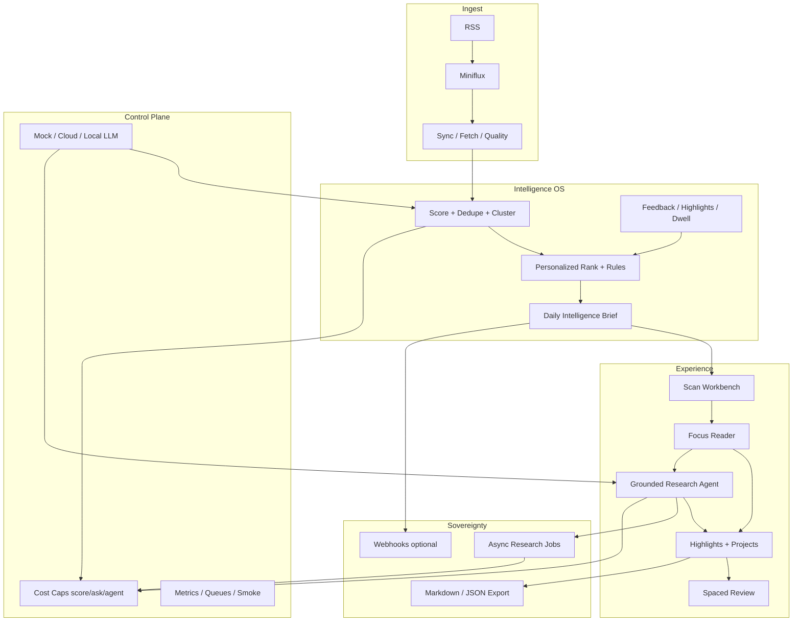

# AI Reader — Product Goal（终态目标）

| 字段 | 值 |
|---|---|
| **状态** | Active Goal（执行中；维护者只做最终审查） |
| **日期** | 2026-07-18 |
| **基线** | `feat/full-project-optimization-round`（B1–B7、反馈、立项、2a 暖刊已在） |
| **原则** | 只描述**产品终态**；不按 Wave/阶段拆目标。实现过程用 commit 回退，不在本文写路线图。 |
| **执行** | Agent 自主实现；高频 commit + push；硬不变量不可破。 |

---

## 1. 一句话终态

**AI Reader 成为自托管的「研究操作系统」**：从 RSS 洪流中持续抽出值得读的信号，用可解释的 AI 排序与中文优先阅读，把划线与问答沉淀成可复习的知识，再变成可导出的研究产物——在**设计完成度、交互手感、AI 研究能力**上对标并超越各自赛道的最佳商业产品，同时保持可自托管、可审计、可关停的成本边界。

不是「带分数的 Miniflux 皮肤」，而是 **Feedly Leo 的情报过滤 × Readwise 的记忆系统 × Ghostreader/Perplexity 的研究助手 × Linear 的键盘与工艺密度 × 自托管主权**。

---

## 2. 对标地图（学什么、超过什么）

| 对标对象 | 他们做到最好的 | AI Reader 终态如何对齐 / 超越 |
|---|---|---|
| **Feedly AI (Leo)** | 多源扫描、AI 优先级、去重、主题/关键词雷达、Team Boards、告警 | 无人值守同步+评分+推荐闭环；主题/实体雷达；「今日必知」情报简报；规则：boost/mute/dedupe；源质量自动降权 |
| **Readwise Reader** | 划线/笔记、键盘阅读、Ghostreader、全文搜索、Daily Review 间隔复习、多格式入口 | 原生划线与笔记（私有）；⌘K + 全键盘；文内研究助手；毫秒级检索；间隔复习队列；RSS 为主并可扩展入口 |
| **Inoreader** | 规则引擎、强力搜索、标签/文件夹、自动化 | 用户可配规则（关键词/源/分数/反馈）；保存搜索；智能标签与项目队列互通 |
| **Perplexity / Notion AI** | 带引用的研究回答、跨文档综合 | 单篇 + **语料库级**研究 Agent：回答必须带原文锚点；周报/对比/立项 brief 可一键生成并导出 |
| **Linear / Arc craft** | 命令面板、快捷键闭环、信息密度与动效克制、状态机清晰 | 任何操作 ≤2 键触达；无死胡同导航；暖刊编辑感 + 数据精密感共存；reduced-motion 一等公民 |
| **Miniflux** | 极简可靠 RSS 真相源 | **永远**保留 Miniflux 为 feeds/entries 上游；AI Reader 只拥有衍生智能层，可拆可换 |
| **Obsidian 生态** | 知识库主权、本地 Markdown | 一键导出 Markdown/JSON；划线与 brief 可进个人库；不绑架用户笔记系统 |

商业产品做不到的我们的壁垒：**数据与模型路径自托管、评分 rubric 可审计、费用硬闸、staging 可公开演示、教学级可运维。**

---

## 3. 终态产品形态（用户感知）

### 3.1 打开即「情报台」，不是「未读堆」

用户进入应用的第一屏是 **研究仪表**，而不是原始 RSS 时间线：

- **今日情报简报（Daily Intelligence）**：自动生成的「今日必读 / 值得扫 / 可忽略」分层；每条有中文摘要、分数环、推荐理由、风险/不确定标记、源可信度。
- **继续阅读 / 未完成项目 / 待复习划线** 三个持久入口。
- **异常与机会雷达**：新高分源、重复风暴、被 demote 的垃圾源、突发主题簇。
- 全局 **⌘K**：搜文章、跳模块、触发同步/评分/研究任务、改主题、查费用余额。

### 3.2 三态心智模型（永远清晰）

| 态 | 目的 | 对标 |
|---|---|---|
| **扫描（Scan）** | 从噪音中分拣 | Feedly boards + AI rank |
| **精读（Focus）** | 沉浸理解与提问 | Readwise + Ghostreader |
| **沉淀（Keep）** | 划线、立项、复习、导出 | Readwise review + Obsidian |

UI 永远让用户知道自己在哪一态；态之间切换无上下文丢失（返回高亮、阅读进度、抽屉状态保留）。

### 3.3 精读页 = 研究工作台

- 杂志级排版（暖刊 2a 为视觉 DNA，继续推到「出版物级」）：首字、合适行宽、衬线标题、暗色纸感、图片与代码可读。
- **划线即记忆**：选区高亮、颜色/标签、旁注；全部私有、可搜、可复习。
- **文内研究助手**：多轮对话；回答 Markdown-only；剥离模型 think；**强制引用原文片段**（可点击跳回段落）。
- **译文与原文对照**、内容质量条（全文/片段/失败可一键重抓）。
- **八维评分可解释面板**：不是装饰，是决策依据；用户反馈一键校准「偏高/偏低/注水/过时…」。
- 底栏/快捷键：已读、候选、立项、分享导出、刷新全文、翻译、问 AI。

### 3.4 力量用户默认

- 列表 j/k、打开、归档、候选、立项、评分维度切换 **全键盘**。
- 命令面板覆盖 100% 主路径；无鼠标可完成晨间分拣。
- 密度模式：舒适 / 紧凑；大屏可双栏对照两篇或「文章 + 笔记」。
- 移动端不是阉割：底部主导航 + 手势返回 + 可离线打开最近正文（PWA）。

---

## 4. 终态能力清单（只写终点，不写阶段）

### A. 情报与排序操作系统

- **全自动管道常开**：同步 → 补全文 → 评分 → 推荐版次 → 简报，按成本闸门安全无人值守。
- **可解释排序**：八维 rubric + 用户反馈在线修正；推荐带 factors（为何第 N 名）。
- **去重与故事线**：同一事件多源合并为 cluster，主条 + 相关源。
- **规则引擎**：用户/管理员可定义 boost、mute、必读源、关键词雷达、分数阈值。
- **源治理**：`hidden`、质量分、自动 demote 低质/残页源；订阅健康仪表。
- **个性化**：长期兴趣向量来自反馈、划线、立项、停留；可重置、可导出。

### B. 阅读与交互工艺

- **世界级阅读 UI**：2a 暖刊 DNA 推到极致；排版、动效、空态、错误态、骨架屏统一 design language。
- **即时感**：列表/详情感知延迟达到「本地应用」；乐观更新；过期请求永不闪回。
- **无障碍**：键盘闭环、焦点陷阱正确、AA 对比、`prefers-reduced-motion`、屏幕阅读器可读分数与状态。
- **国际化阅读**：中文优先摘要/助手；原文保留；中英检索都好用。

### C. 知识与记忆

- **私有标注系统**：高亮、笔记、标签；文章级与选区级。
- **间隔复习（Daily Review）**：不是又一个列表，而是主动把高价值划线送回视野。
- **项目工作区**：候选 → 立项 → 项目 brief → 导出包（MD/JSON/zip）。
- **主题簇 / 轻图谱**：自动聚类 + 人工钉选；从一篇跳到「同一问题的其他源」。
- **搜索**：标题/正文/划线/笔记统一检索；过滤器可保存。

### D. 研究 Agent

- **单篇 Agent**：定义、简化、反驳、提取行动项、生成闪卡。
- **语料 Agent（受预算约束）**：跨今日 TopN / 某项目 / 某主题提问；答案带引用图。
- **任务型产出**：周研究简报、竞品/技术雷达、立项一页纸——异步 job，可轮询、可重跑、可导出。
- **模型路由**：mock / 云 LLM / **本地 LLM profile**；所有路径合同测试一致。
- **费用操作系统**：score / ask / agent **分账户日限额** + 云控制台硬顶；Admin 一眼看清今日烧了什么。

### E. 平台与主权

- Miniflux 仍是 RSS 事实源；AI Reader 衍生状态可备份/恢复。
- 鉴权 fail-closed；staging 公开演示与 prod 严格隔离不变。
- 可观测：延迟、队列堆积、LLM 调用、错误预算。
- 出站 webhook（简报/高分）可选；不绑死单一笔记软件。
- 多用户协作（共享项目/ACL）作为能力存在，但默认单人研究质量不下降。

---

## 5. 设计系统终态（视觉与交互目标）

对标 **Linear 的信息密度与快捷键**、**Readwise 的阅读专注**、**高端刊物的排版**，在已有 2a「暖刊·数据」上封顶：

| 维度 | 终态标准 |
|---|---|
| 品牌 | 单一 indigo 强调 + 暖纸阅读色；tier 四色只用于档位语义 |
| 字体 | UI 无衬线精密；阅读衬线（中英）；等宽用于分数/快捷键 |
| 布局 | 情报台 / 扫描列表 / 精读 / 复习 / 管理 五套布局共享 token，不共享脏 CSS |
| 动效 | 120–240ms 标准曲线；骨架→内容无布局抖动；reduced-motion 等价静态 |
| 空态 | 每个主视图有「下一步」叙事（订阅、同步、评分、划线） |
| 移动 | 同一产品，不是桌面缩小版 |
| 禁止 | 再引入第二套组件库美学分叉；禁止为「看起来现代」牺牲可读性 |

**FRONTEND 规格以运行中的 2a 实现为真源**；旧 Tailwind/shadcn 理想稿仅历史参考，不再指导实现。

---

## 6. 体验质量条（终态可验收）

下列是**产品完成时**的验收条，不是施工顺序：

| 类别 | 终态标准 |
|---|---|
| 晨间分拣 | 熟练用户可在 **5 分钟内**完成「今日该读什么」决策（键盘 only） |
| 解释性 | 任意推荐位可回答「为什么出现在这里」 |
| 精读 | 全文可读或明确残页+一键修复；助手回答可追溯原文 |
| 记忆 | 划线 → 当日可搜 → 复习队列可重见 → 可导出 |
| 搜索 | 中英标题/正文子串可靠命中；保存的过滤器可复用 |
| 性能 | 列表/详情体感本地化；无整页白屏闪烁；无错误乐观回跳 |
| 成本 | 无人值守开启时，日费用被多层闸门夹住且 Admin 可见 |
| 安全 | sanitize / think-strip / Markdown-only / CSRF / prod 401 / admin 403 永真 |
| 可靠 | smoke 三断言永绿；队列可解释；失败有下一步 |
| 美感 | 陌生人截图会问「这是什么 App」而不是「又一个 RSS」 |

---

## 7. 硬不变量（任何实现都不可破）

1. `sanitizeArticleHtml()`：一切 RSS/抓取 HTML 渲染前净化；PWA/离线缓存再展示仍要净化。
2. Agent：剥离 `<think>`；**只渲染 Markdown**，永不渲染模型原始 HTML。
3. 浏览器 **永不**直连 Miniflux 或 Postgres；状态写入只经 FastAPI。
4. `saved → project` 业务规则与 API 契约保持严谨（先候选后立项等既有语义可增强不可偷偷绕过）。
5. Staging 匿名演示边界与 prod fail-closed；admin 恒需 `require_admin`。
6. Secrets 不进 git；自动化测试默认 mock LLM。
7. Miniflux 保持 feeds/entries 上游真相；AI Reader 库可重建衍生状态。

---

## 8. 明确不是终态的东西（防跑偏）

- 变成通用笔记软件或再造 Obsidian。
- 变成社交媒体阅读器或推荐信息流广告场。
- 为多租户 SaaS 牺牲单人研究体验。
- 引入 Meilisearch/图数据库等重依赖作为默认必装（终态搜索/聚类以 **Postgres 可运维方案** 为默认；只有压测证明不够才议外置）。
- 全站重写成另一套 UI 框架只为「跟风」。
- 无预算闸门的「全自动狂烧 token」。

---

## 9. 架构终态意象（逻辑，非工期）

---

## 10. 当前现实 → 终态差距（一览，仍不是阶段计划）

| 终态能力 | 现状粗判 |
|---|---|
| 自动情报管道 | 人工触发为主；缺常开调度与简报产品化 |
| 服务端研究队列 | 列表过滤/排序大量在客户端 |
| 键盘 / ⌘K | 基本缺失 |
| 划线 / 复习 | 表或概念零星，无产品闭环 |
| 搜索 | 无真正检索体验 |
| 推荐可解释 factors | 部分分数有，产品化不足 |
| 研究 Agent | 单篇 SSE 问答；缺引用锚点、多轮帽、语料级任务 |
| 费用驾驶舱 | 有 cap 零件，缺统一运营视图 |
| 阅读工艺 | 2a 已上路，距「出版物级 + 力量用户」仍有明显空间 |
| PWA / 本地 LLM | 未成为产品能力 |

实现时直接朝终态补齐；用 git 历史回退，不在本文拆「第几期做什么」。

---

## 11. 执行约定（给 Agent）

1. **本文是唯一产品 Goal**；旧「分 Wave 施工设计」只作技术备忘，不覆盖本文终态。
2. 每次有意义的进度：**commit + push**，message 说清用户可感知变化；保证随时可回退。
3. 改动遵守 AGENTS.md：最小足够、可验证、不顺手重构无关代码。
4. 涉及 API 形状：同步 `openapi.json` + `generated/schema.ts`。
5. 验证：触及面运行对应 `npm test` / `pytest` / compose config / `git diff --check`。
6. 维护者只做最终审查与生产密钥/账户上限类运维动作。

---

## 12. 成功时的产品叙事（对外一句话）

> 我不再「追 RSS」，而是每天打开一个**知道我在研究什么**的自托管工作台：它已经读过所有源，告诉我该读什么、为什么、哪里有风险；我划下的句子会回来找我；我问的问题能指回原文；我立项的东西能导出成研究资产。

---

*End of Goal. 实现即向本文件收敛；不在此追加阶段表。*
