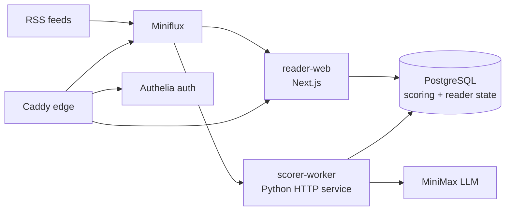

# Reno RSS / AI Reader

[English](README.md) | [中文](README.zh-CN.md)


AI Reader is a self-hosted RSS research workspace built on top of Miniflux. It adds LLM scoring, Chinese summaries, article Q&A, focused reading, feed quality controls, and GitHub Actions based delivery on top of a traditional RSS backend.

## Live Demo

- Demo: [https://staging-ai-reader.blankhoney.xyz/](https://staging-ai-reader.blankhoney.xyz/)
- Source: [github.com/blankhoney/reno_rss](https://github.com/blankhoney/reno_rss)

Open the demo URL and use the one-click guest entry on the landing page. The guest account is limited to the staging AI Reader domain.

## What It Does

- **Unified RSS workspace**: Miniflux remains the feed source of truth while AI Reader provides a richer reading and triage UI.
- **LLM article scoring**: MiniMax scores each article across importance, usefulness, timeliness, depth, technical value, business value, and trend value.
- **Chinese-first summaries**: scored articles get Chinese summaries, original-language summaries, and per-dimension reasoning.
- **Focused reading**: article pages support refreshed Miniflux content, partial-content warnings, Markdown-rendered AI answers, and an assistant drawer.
- **Research workflow**: latest, unread, read, starred, read-later, project queue, and score-dimension modules support a new -> candidate -> project flow.
- **Feed quality governance**: recent content quality, scores, and user actions demote weak feeds; feeds can be hidden/restored without deleting Miniflux subscriptions.
- **Public demo entry**: staging has a safe public landing page with same-origin Authelia demo login and a minimal exposed Caddy surface.

## Engineering Highlights

- **Small-service architecture**: Next.js reader-web, Python scorer-worker, Miniflux, PostgreSQL, Caddy, and Authelia are isolated through Docker Compose overlays.
- **Event-driven scoring**: scorer-worker exposes internal HTTP endpoints for manual scoring and Miniflux webhook scoring instead of relying on broad periodic rescans.
- **Layered auth design**: Caddy/Authelia can provide an outer demo or defense-in-depth layer, while the app/API owns session, role, CSRF, and rate-limit enforcement for business routes.
- **Automated delivery**: GitHub Actions run tests/builds, validate Compose, scan with Trivy, publish GHCR images, deploy staging, and support approved production deploys and rollback.
- **Operational scripts**: deployment, smoke test, backup, restore, and rollback scripts live under `infra/scripts`.

See [TECHNICAL.md](TECHNICAL.md) for deeper system design and security boundaries. See [SPEC-CICD.md](SPEC-CICD.md) for the delivery specification.

## Architecture



Runtime services:

- `reader-web`: AI Reader UI and API routes.
- `scorer-worker`: internal scoring/webhook service.
- `miniflux`: RSS backend and feed state.
- `postgres`: Miniflux database plus scoring/reader metadata database.
- `caddy`: public HTTPS reverse proxy.
- `authelia`: login, 2FA, and forward-auth.

## Repository Layout

```text
apps/
  reader-web/        Next.js AI Reader UI and API routes
  scorer-worker/    Python scoring service and tests
infra/
  authelia/          Authelia configuration template and placeholder user DB
  caddy/             Public edge routing
  compose/           Docker Compose base, edge, staging, and prod overlays
  postgres/init/     Initial database/user bootstrap
  scripts/           deploy, smoke-test, backup, restore, rollback
.github/
  workflows/         CI, staging/prod deploy, rollback
  scripts/           GitHub Actions remote deploy helpers
```

## Requirements

- Docker and Docker Compose v2
- Node.js 22 for `apps/reader-web`
- Python 3.12 for `apps/scorer-worker`
- A Miniflux admin account
- A MiniMax API key for LLM scoring
- VPS/runtime secrets stored outside Git

## Configuration

Start from the tracked example file:

```bash
cp .env.example .env
```

Fill runtime values in `.env`, including:

- `DOMAIN`
- PostgreSQL passwords and database URLs
- Miniflux admin username/password
- scorer webhook username/password
- MiniMax API key/base URL/model
- SMTP settings for Authelia notifications
- optional staging demo values such as `DEMO_USERNAME` and `DEMO_PASSWORD`

Keep real secrets out of Git. For Authelia users, `AUTHELIA_USERS_DATABASE_FILE` can point to a server-local file such as `/root/opt/myrss/secrets/users_database.yml`.

## Local Checks

Reader web:

```bash
cd apps/reader-web
npm ci
npm test
npm run build
```

Scorer worker:

```bash
cd apps/scorer-worker
python -m pip install -e ".[dev]"
python -m pytest tests -q
ruff check src/
```

Compose validation:

```bash
cp .env.example .env
docker compose --profile worker --env-file .env \
  -f infra/compose/docker-compose.base.yml \
  -f infra/compose/docker-compose.staging.yml config

docker compose --profile worker --env-file .env \
  -f infra/compose/docker-compose.base.yml \
  -f infra/compose/docker-compose.prod.yml config
```

## Deployment

The deploy script supports `staging` and `prod`:

```bash
bash infra/scripts/deploy.sh staging sha-xxxxxxx
bash infra/scripts/deploy.sh prod sha-xxxxxxx
```

Production deploys must follow the v0.4 gate: database backup with artifact + SHA256, migration dry-run/upgrade, non-mutating smoke checks, image rollback first on app failure, and DB restore only for schema/data damage.

Deployment modes:

- **Local build mode**: builds `reader-web` and `scorer-worker` on the VPS.
- **Remote image mode**: pulls GHCR images using `IMAGE_REGISTRY` and `IMAGE_TAG`, then runs Compose with `--no-build`.

Post-deploy smoke test:

```bash
bash infra/scripts/smoke-test.sh staging
bash infra/scripts/smoke-test.sh prod
```

## CI/CD

GitHub Actions provide:

- `ci.yml`: Python lint/test, reader-web test/build, Compose config validation, Trivy scan, GHCR image build/push, and automatic staging deploy for same-repository PRs and `main` pushes.
- `deploy-staging.yml`: manual staging deploy by image tag as a fallback.
- `deploy-prod.yml`: manual production deploy by image tag through the `production` environment.
- `rollback.yml`: staging/prod rollback to a previous GHCR image tag.

The normal staging path is `push main -> checks -> GHCR images -> VPS pull -> smoke test`. Manual VPS commands should only be needed for one-time server readiness or incident recovery.

Image tags must match the deployed revision, for example `sha-7d59513`. Full delivery requirements are defined in [SPEC-CICD.md](SPEC-CICD.md).

Required repository secrets for remote deploys:

- `VPS_HOST`
- `VPS_USER`
- `VPS_SSH_KEY` or `VPS_SSH_KEY_B64`
- `VPS_APP_DIR`
- `GHCR_USERNAME`
- `GHCR_TOKEN`

## Security Notes

- Do not commit real `.env`, API keys, SSH keys, Authelia user databases, or VPS runtime secrets.
- `.env.example` must stay placeholder-only.
- The scorer mutating endpoints are intended for the internal Docker network and require Basic Auth.
- Public access is routed through Caddy; Authelia is an outer/demo or defense-in-depth layer, and the app/API must enforce business auth itself.
- The staging demo password is a public experience password, not a production secret; it should still be rotated when needed.

## License

MIT. See [LICENSE](LICENSE).
