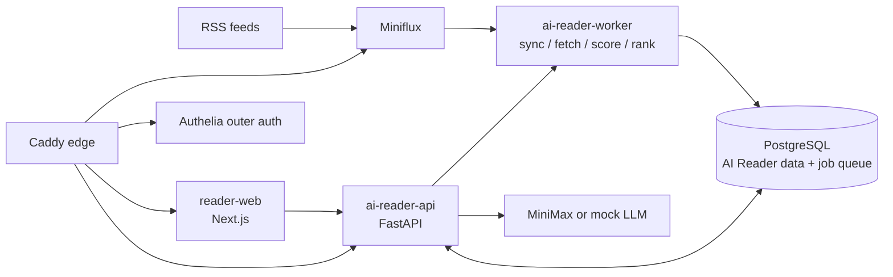

# Reno RSS / AI Reader

[English](README.md) | [中文](README.zh-CN.md)

[](https://github.com/blankhoney/reno_rss/actions/workflows/ci.yml)


AI Reader is a self-hosted RSS research workspace built on Miniflux.
It turns a shared RSS feed pool into scored, explainable, Chinese-first reading queues for a small research team.

## Live Demo

- Staging app: [https://staging-ai-reader.blankhoney.xyz/](https://staging-ai-reader.blankhoney.xyz/)
- Source: [github.com/blankhoney/reno_rss](https://github.com/blankhoney/reno_rss)

Open the staging URL, enter a display name, and save the recovery code shown after login. The public root renders an AI Reader session shell; article data and admin operations are still protected by the FastAPI session and role checks.

## Table of Contents

- [Background](#background)
- [Features](#features)
- [Architecture](#architecture)
- [Repository Layout](#repository-layout)
- [Requirements](#requirements)
- [Install](#install)
- [Configuration](#configuration)
- [Usage](#usage)
- [Local Checks](#local-checks)
- [Deployment](#deployment)
- [CI/CD](#cicd)
- [Maintainers](#maintainers)
- [Contributing](#contributing)
- [Security](#security)
- [License](#license)

## Background

Miniflux remains the RSS engine and source of truth for fetched entries. AI Reader owns the product layer around it: users, sessions, saved/read state, content-quality state, scoring batches, Top10 recommendation editions, article Q&A, and admin operations.

The v0.4 architecture centers on one FastAPI API, one queue-driven worker, and one Next.js web app. The goal is not just "AI summaries for RSS"; it is a repeatable system for finding useful articles, explaining why they matter, and turning them into project or study leads.

## Features

- **FastAPI-backed reader workbench**: login/recovery sessions, article list/detail, saved/read state, content-fetch jobs, recommendations, admin sync/scoring, and article ask all go through same-origin `/api/*`.
- **8-dimension scoring rubric**: `topic_relevance`, `information_density`, `source_quality`, `novelty`, `timeliness`, `actionability`, `reading_cost_fit`, and `risk_uncertainty`.
- **Explainable Top10**: recommendation editions store rank, tier, rank score, reason, source, risk flags, and risk uncertainty for each item.
- **Chinese-first summaries and reasons**: scoring writes Chinese summaries, original-language summaries, tags, total reasons, dimension reasons, confidence, and risk flags.
- **Focused reading**: article pages support sanitized HTML, partial-content notices, refreshed-content jobs, quick actions, and Markdown-rendered assistant answers.
- **Streaming article Q&A**: `/api/articles/{id}/ask` streams SSE answers while stripping model reasoning blocks before display.
- **Admin operations console**: admins can enqueue Miniflux sync, create bounded scoring batches, start jobs, poll status, and reload batch detail.
- **Staging runtime proof**: CI deploys staging and runs a chain proof for sync -> content fetch -> mock scoring -> recommendations -> ask SSE.

## Architecture



Runtime services:

- `reader-web`: Next.js UI for the workbench, focused reading, auth gate, Top10, and admin console.
- `ai-reader-api`: FastAPI service for sessions, articles, state, recommendations, jobs, admin APIs, and ask SSE.
- `ai-reader-worker`: Python queue worker for Miniflux sync, content fetch, scoring batches, and recommendation generation.
- `miniflux`: RSS engine and operational feed source.
- `postgres`: Miniflux database plus AI Reader schema, job queue, scores, recommendations, and user state.
- `caddy`: public HTTPS reverse proxy and routing boundary.
- `authelia`: outer forward-auth layer for protected web routes.

Important boundary: Caddy routes `/api/*` directly to FastAPI. FastAPI self-guards business APIs with `require_user` and `require_admin`; web pages can still sit behind Authelia as defense in depth.

## Repository Layout

```text
apps/
  api/             FastAPI app, Alembic migrations, OpenAPI export, API tests
  worker/          Python job worker, ranking/scoring/sync logic, worker tests
  reader-web/      Next.js UI, FastAPI client adapters, component tests
infra/
  authelia/        Authelia configuration template and placeholder user DB
  caddy/           Public edge routing
  compose/         Docker Compose base, edge, staging, and prod overlays
  postgres/init/   Initial database/user bootstrap
  scripts/         deploy, smoke-test, backup, restore, rollback, runtime proof
docs/
  spec/            v0.4 architecture, data model, API, deployment, security specs
  runbooks/        Backup/restore, deploy, incident, and rollback procedures
.github/
  workflows/       CI, staging/prod deploy, rollback
  scripts/         GitHub Actions remote deploy helpers
```

## Requirements

- Docker and Docker Compose v2
- Node.js 22 for `apps/reader-web`
- Python 3.12 and `uv` for `apps/api` and `apps/worker`
- A Miniflux admin account
- MiniMax credentials for real LLM scoring, or `LLM_PROVIDER=mock` for tests and staging proof
- VPS/runtime secrets stored outside Git

## Install

Clone the repository and install per app:

```bash
git clone https://github.com/blankhoney/reno_rss.git
cd reno_rss

cd apps/reader-web
npm ci

cd ../api
uv run --isolated --with-editable . --extra dev python -m pytest tests -q

cd ../worker
uv run --isolated --with-editable . --extra dev python -m pytest tests -q
```

For deployment configuration, start from the tracked example:

```bash
cp .env.example .env
```

Do not commit the resulting `.env`.

## Configuration

Fill these groups in `.env` or in server-local secret stores:

- Domain and upstream routing: `DOMAIN`, `AI_READER_*_UPSTREAM`, `AI_READER_CSRF_ALLOWED_ORIGINS`
- Images: `IMAGE_REGISTRY`, `AI_READER_WEB_IMAGE`, `AI_READER_API_IMAGE`, `AI_READER_WORKER_IMAGE`
- Miniflux: `MINIFLUX_ADMIN`, `MINIFLUX_ADMIN_PASSWORD`, `MINIFLUX_DATABASE_URL`, `MINIFLUX_API_BASE_URL`, `MINIFLUX_API_KEY`
- PostgreSQL: `POSTGRES_*`, `SCORING_DATABASE_URL`
- Reader/API defaults: `READER_TENANT_ID`, `READER_MINIFLUX_USER_ID`
- LLM and worker: `LLM_PROVIDER`, `MINIMAX_API_KEY`, `MINIMAX_BASE_URL`, `MINIMAX_MODEL`, `LLM_TIMEOUT_SECONDS`, `WORKER_CONCURRENCY`, `EXTERNAL_CONTENT_PROVIDER`
- Staging auth/demo labels: `DEMO_USERNAME`, `DEMO_PASSWORD`, `DEMO_AUTHELIA_BASE_URL`, `DEMO_TARGET_URL`, `DEMO_ALLOWED_ORIGIN`
- Authelia SMTP and users database: `SMTP_*`, `AUTHELIA_USERS_DATABASE_FILE`

Real `.env`, Authelia users, API keys, SSH keys, and runtime secrets must stay out of Git.

## Usage

Common local commands:

```bash
# reader-web
cd apps/reader-web
npm test
npm run build

# api
cd apps/api
uv run --isolated --with-editable . --extra dev python -m pytest tests -q
uv run --isolated --with-editable . --extra dev ruff check .
uv run --isolated --with-editable . --extra dev python -m app.export_openapi --out openapi.json

# worker
cd apps/worker
uv run --isolated --with-editable . --extra dev python -m pytest tests -q
uv run --isolated --with-editable . --extra dev ruff check .
```

Run Compose config checks without overwriting a local `.env`:

```bash
docker compose --profile worker --env-file .env.example \
  -f infra/compose/docker-compose.base.yml \
  -f infra/compose/docker-compose.staging.yml config

docker compose --profile worker --env-file .env.example \
  -f infra/compose/docker-compose.base.yml \
  -f infra/compose/docker-compose.prod.yml config

docker compose --env-file .env.example \
  -f infra/compose/docker-compose.edge.yml config
```

## Local Checks

Before committing a tracked change, run the smallest relevant gate plus:

```bash
git diff --check
```

Minimum checks by area:

- `apps/reader-web`: `npm test` and `npm run build`
- `apps/api`: `python -m pytest tests -q` and `ruff check .` through `uv run --isolated --with-editable . --extra dev`
- `apps/worker`: `python -m pytest tests -q` and `ruff check .` through `uv run --isolated --with-editable . --extra dev`
- Compose or deploy scripts: render affected overlays and run `bash -n infra/scripts/*.sh .github/scripts/*.sh`

## Deployment

Deploy scripts support `staging` and `prod`:

```bash
bash infra/scripts/deploy.sh staging sha-xxxxxxx
bash infra/scripts/deploy.sh prod sha-xxxxxxx
```

Production deploys are manual and protected. The production path must run the backup gate before migrations and should roll back the image before restoring a database backup unless the failure is schema/data damage.

Post-deploy smoke:

```bash
bash infra/scripts/smoke-test.sh staging
bash infra/scripts/smoke-test.sh prod
```

The staging CI path also runs `infra/scripts/staging-runtime-proof.sh`. It proves the sync/content-fetch/scoring/recommendation/ask chain when API and worker both use `LLM_PROVIDER=mock`, and skips the deep proof when either service is configured for a real provider.

## CI/CD

GitHub Actions provide:

- `ci.yml`: API tests/lint, worker tests/lint, OpenAPI export and typed-client drift check, Alembic upgrade, reader-web tests/build, Compose validation, deploy-script checks, Docker builds, Trivy scan, GHCR image publish, and staging deploy for same-repository PRs and `main` pushes.
- `deploy-staging.yml`: manual staging deploy by image tag.
- `deploy-prod.yml`: manual production deploy through the `production` environment.
- `rollback.yml`: staging/prod rollback to a previous GHCR image tag.

Published images:

- `ghcr.io/<owner>/reno_rss/ai-reader-web:sha-<short_sha>`
- `ghcr.io/<owner>/reno_rss/ai-reader-api:sha-<short_sha>`
- `ghcr.io/<owner>/reno_rss/ai-reader-worker:sha-<short_sha>`

Full delivery behavior is specified in [SPEC-CICD.md](SPEC-CICD.md).

## Maintainers

Maintainer: `blankhoney`.

Operational runbooks live in [docs/runbooks](docs/runbooks). Current v0.4 design specs live in [docs/spec](docs/spec).

## Contributing

This is also a teaching repository. Read [AGENTS.md](AGENTS.md) and the repo-local plan files before changing code. Prefer precise, verified changes over broad refactors; update `docs/learning-notes.md` when behavior, architecture, deployment, process, or durable debugging knowledge changes.

## Security

- Never commit real `.env`, Authelia user databases, API keys, SSH keys, cookies, or VPS runtime secrets.
- `.env.example` must remain placeholder-only.
- `/api/*` is routed to FastAPI and must fail closed for anonymous or non-admin callers where required.
- Article HTML is untrusted and is sanitized before rendering.
- Article ask responses strip `<think>` blocks before display.
- Automated smoke/runtime proof must not spend real LLM tokens; the deep runtime proof runs only with `LLM_PROVIDER=mock`.

## License

MIT. See [LICENSE](LICENSE).
