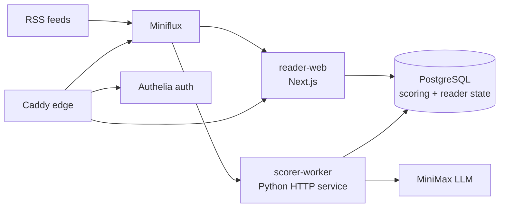

# Reno RSS / AI Reader

[English](README.md) | [中文](README.zh-CN.md)

AI Reader is a self-hosted RSS reading workspace built on top of Miniflux. It adds LLM scoring, Chinese summaries, article Q&A, focused reading, feed quality controls, and a Docker/GitHub Actions deployment pipeline.

The project is optimized for a personal research/news workflow: new RSS entries arrive in Miniflux, selected entries are scored by MiniMax, and the reader UI ranks, summarizes, filters, and opens articles with an AI assistant.

## Features

- **RSS ingestion** through Miniflux, backed by PostgreSQL.
- **AI Reader web app** built with Next.js, React, TypeScript, and server-side Miniflux/scoring reads.
- **Event-driven scoring service** with Python, MiniMax, PostgreSQL persistence, and internal HTTP endpoints:
  - `GET /healthz`
  - `POST /internal/score-entry`
  - `POST /webhooks/miniflux`
- **Reader workflow** with latest/unread/read/starred/project/read-later modules, focused reading pages, article Q&A, markdown answer rendering, manual rescoring, and scoring settings.
- **Feed quality governance** using recent-article quality signals, score signals, and user actions to demote low-quality feeds and manually hide/restore feeds without deleting Miniflux subscriptions.
- **Self-hosted edge and auth** with Caddy, Authelia, Docker Compose, staging/prod overlays, backup/restore scripts, and smoke tests.
- **CI/CD** with GitHub Actions checks, GHCR image publishing, staging deploy, production deploy, and rollback workflows.

## Architecture



Runtime services:

- `reader-web`: AI Reader UI and API routes.
- `scorer-worker`: internal scoring/webhook service.
- `miniflux`: RSS backend and source-of-truth feed store.
- `postgres`: Miniflux database plus scoring/reader metadata database.
- `caddy`: public HTTPS reverse proxy.
- `authelia`: forward-auth and user login.

## Repository Layout

```text
apps/
  reader-web/        Next.js AI Reader UI and API routes
  scorer-worker/    Python scoring service and tests
infra/
  authelia/          Authelia configuration template and local placeholder user DB
  caddy/             Public edge routing
  compose/           Docker Compose base, edge, staging, and prod overlays
  postgres/init/     Initial database/user bootstrap
  scripts/           deploy, smoke-test, backup, restore, rollback
.github/
  workflows/         CI, staging/prod deploy, rollback
  scripts/           GitHub Actions remote deploy helpers
```

## Requirements

- Docker and Docker Compose v2
- Node.js 22 for `apps/reader-web`
- Python 3.12 for `apps/scorer-worker`
- A Miniflux admin account
- A MiniMax API key for LLM scoring
- VPS/runtime secrets stored outside Git

## Configuration

Start from the tracked example file:

```bash
cp .env.example .env
```

Then fill the runtime values in `.env`, including:

- `DOMAIN`
- PostgreSQL passwords and database URLs
- Miniflux admin username/password
- scorer webhook username/password
- MiniMax API key/base URL/model
- SMTP settings for Authelia notifications

Keep real secrets out of Git. For Authelia users, `AUTHELIA_USERS_DATABASE_FILE` can point to a server-local file such as `/root/opt/myrss/secrets/users_database.yml`.

## Local Checks

Reader web:

```bash
cd apps/reader-web
npm ci
npm test
npm run build
```

Scorer worker:

```bash
cd apps/scorer-worker
python -m pip install -e ".[dev]"
python -m pytest tests -q
ruff check src/
```

Compose validation:

```bash
cp .env.example .env
docker compose --profile worker --env-file .env \
  -f infra/compose/docker-compose.base.yml \
  -f infra/compose/docker-compose.staging.yml config

docker compose --profile worker --env-file .env \
  -f infra/compose/docker-compose.base.yml \
  -f infra/compose/docker-compose.prod.yml config
```

## Deployment

The deploy script supports `staging` and `prod`:

```bash
bash infra/scripts/deploy.sh staging sha-xxxxxxx
bash infra/scripts/deploy.sh prod sha-xxxxxxx
```

Deployment modes:

- **Local build mode**: builds `reader-web` and `scorer-worker` on the VPS.
- **Remote image mode**: pulls GHCR images using `IMAGE_REGISTRY` and `IMAGE_TAG`, then runs Compose with `--no-build`.

Post-deploy smoke test:

```bash
bash infra/scripts/smoke-test.sh staging
bash infra/scripts/smoke-test.sh prod
```

## CI/CD

GitHub Actions currently provide:

- `ci.yml`: Python lint/test, reader-web test/build, Compose config validation, Trivy scan, GHCR image build/push, and same-repo PR staging deploy.
- `deploy-staging.yml`: manual staging deploy by image tag.
- `deploy-prod.yml`: manual production deploy by image tag through the `production` environment.
- `rollback.yml`: staging/prod rollback to a previous GHCR image tag.

Required repository secrets for remote deploys:

- `VPS_HOST`
- `VPS_USER`
- `VPS_SSH_KEY` or `VPS_SSH_KEY_B64`
- `VPS_APP_DIR`
- `GHCR_USERNAME`
- `GHCR_TOKEN`

## Security Notes

- Do not commit real `.env`, API keys, SSH keys, Authelia user databases, or VPS runtime secrets.
- `.env.example` must stay placeholder-only.
- The scorer endpoints are intended for the internal Docker network and require Basic Auth for mutating requests.
- Public access is routed through Caddy and protected by Authelia.
