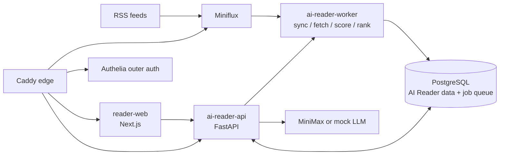

<p align="center">
  
</p>

<h1 align="center">AI Reader</h1>

<p align="center">
  <strong>A self-hosted RSS research workspace that turns Miniflux feeds into scored, explainable, Chinese-first reading queues.</strong>
</p>

<p align="center">
  <a href="README.zh-CN.md">中文</a>
  ·
  <a href="https://staging-ai-reader.blankhoney.xyz/">Live Demo</a>
  ·
  <a href="#highlights">Highlights</a>
  ·
  <a href="#architecture">Architecture</a>
  ·
  <a href="#quick-start">Quick Start</a>
  ·
  <a href="#deployment">Deployment</a>
</p>

<p align="center">
  <a href="https://github.com/blankhoney/reno_rss/actions/workflows/ci.yml"></a>
  
  
  
  
  
</p>

AI Reader adds a product layer on top of Miniflux. Miniflux remains the RSS engine and source of truth for fetched entries; AI Reader owns sessions, article state, scoring batches, Top10 recommendation editions, article Q&A, and admin operations.

The current v0.4 stack is one FastAPI API, one queue-driven Python worker, and one Next.js web app. It is designed for a small research team that needs to find useful articles, understand why they matter, and turn feeds into project or study leads.

## Live Demo

- Staging app: [https://staging-ai-reader.blankhoney.xyz/](https://staging-ai-reader.blankhoney.xyz/)
- Source: [github.com/blankhoney/reno_rss](https://github.com/blankhoney/reno_rss)

Open the staging URL, enter a display name, and save the recovery code shown after login. The public root renders an AI Reader session shell; article data and admin operations are protected by FastAPI session and role checks, with Caddy/Authelia still available as the page-route boundary.

## Highlights

| Area | What AI Reader provides |
| --- | --- |
| Reader workbench | Same-origin `/api/*` access to article lists, detail pages, saved/read state, content refresh jobs, recommendations, and article Q&A. |
| Scoring rubric | Eight dimensions: `topic_relevance`, `information_density`, `source_quality`, `novelty`, `timeliness`, `actionability`, `reading_cost_fit`, and `risk_uncertainty`. |
| Explainable Top10 | Recommendation editions persist rank, tier, rank score, reason, source, risk flags, and uncertainty for each selected article. |
| Chinese-first output | Scoring stores Chinese summaries, original-language summaries, tags, total reasons, dimension reasons, confidence, and risk flags. |
| Focused reading | Sanitized article HTML, partial-content notices, refreshed-content jobs, quick prompts, and Markdown-rendered assistant answers. |
| Streaming Q&A | `/api/articles/{id}/ask` streams Server-Sent Events and strips model reasoning blocks before display. |
| Admin console | Admins can enqueue Miniflux sync, create bounded scoring batches, start jobs, poll status, and reload batch details. |
| Runtime proof | Staging CI can prove sync, content fetch, mock scoring, recommendations, and ask SSE without spending real LLM tokens. |

## Architecture


```mermaid
flowchart LR
  RSS[RSS feeds] --> Miniflux[Miniflux]
  Miniflux --> Worker[ai-reader-worker<br/>sync / fetch / score / rank]
  Worker --> DB[(PostgreSQL<br/>AI Reader data + job queue)]
  API[ai-reader-api<br/>FastAPI] <--> DB
  API --> Worker
  API --> LLM[MiniMax or mock LLM]
  Web[reader-web<br/>Next.js] --> API
  Caddy[Caddy edge] --> Web
  Caddy --> API
  Caddy --> Miniflux
  Caddy --> Authelia[Authelia outer auth]
```

| Runtime service | Responsibility |
| --- | --- |
| `reader-web` | Next.js UI for the workbench, focused reader, auth shell, Top10 rail, and admin console. |
| `ai-reader-api` | FastAPI service for sessions, articles, state, recommendations, jobs, admin APIs, and ask SSE. |
| `ai-reader-worker` | Python queue worker for Miniflux sync, content fetch, scoring batches, translation, and recommendation generation. |
| `miniflux` | RSS engine and operational feed source. |
| `postgres` | Miniflux data plus AI Reader schema, job queue, scores, recommendations, sessions, and user state. |
| `caddy` | Public HTTPS reverse proxy and routing boundary. |
| `authelia` | Optional outer forward-auth layer for protected page routes. |

Important boundary: Caddy routes `/api/*` directly to FastAPI. Business APIs must fail closed inside FastAPI through `require_user` and `require_admin`; web pages may still sit behind Authelia as defense in depth.

## Repository Map

```text
apps/
  api/             FastAPI app, Alembic migrations, OpenAPI export, API tests
  worker/          Python job worker, scoring/ranking/sync/translation logic
  reader-web/      Next.js UI, generated FastAPI client adapters, component tests
infra/
  authelia/        Authelia configuration template and placeholder user database
  caddy/           Public edge routing
  compose/         Docker Compose base, edge, staging, and production overlays
  postgres/init/   Initial database/user bootstrap
  scripts/         Deploy, smoke-test, backup, restore, rollback, runtime proof
.github/
  workflows/       CI, staging/prod deploy, rollback
  scripts/         GitHub Actions remote deploy helpers
```

Public architecture and delivery notes live in [TECHNICAL.md](TECHNICAL.md) and [SPEC-CICD.md](SPEC-CICD.md). Local learning notes and operator runbooks under `docs/` are intentionally kept outside Git.

## Quick Start

Requirements:

- Docker and Docker Compose v2
- Node.js 22 for `apps/reader-web`
- Python 3.12 and `uv` for `apps/api` and `apps/worker`
- A Miniflux admin account
- MiniMax credentials for real LLM scoring, or `LLM_PROVIDER=mock` for tests and staging proof

Clone and verify the three application surfaces:

```bash
git clone https://github.com/blankhoney/reno_rss.git
cd reno_rss

cd apps/reader-web
npm ci
npm test
npm run build

cd ../api
uv run --isolated --with-editable . --extra dev python -m pytest tests -q

cd ../worker
uv run --isolated --with-editable . --extra dev python -m pytest tests -q
```

Create a local runtime configuration from the tracked template:

```bash
cp .env.example .env
```

Do not commit the generated `.env`.

## Configuration

Fill these groups in `.env` or in server-local secret stores:

| Group | Example variables |
| --- | --- |
| Domain and routing | `DOMAIN`, `AI_READER_*_UPSTREAM`, `AI_READER_CSRF_ALLOWED_ORIGINS`, `AI_READER_ANONYMOUS_DEMO` |
| Images | `IMAGE_REGISTRY`, `AI_READER_WEB_IMAGE`, `AI_READER_API_IMAGE`, `AI_READER_WORKER_IMAGE` |
| Miniflux | `MINIFLUX_ADMIN`, `MINIFLUX_ADMIN_PASSWORD`, `MINIFLUX_DATABASE_URL`, `MINIFLUX_API_BASE_URL`, `MINIFLUX_API_KEY` |
| PostgreSQL | `POSTGRES_*`, `SCORING_DATABASE_URL` |
| Reader/API defaults | `READER_TENANT_ID`, `READER_MINIFLUX_USER_ID` |
| LLM, API safety, and worker | `LLM_PROVIDER`, `MINIMAX_API_KEY`, `MINIMAX_BASE_URL`, `MINIMAX_MODEL`, `LLM_TIMEOUT_SECONDS`, `LLM_DAILY_CALL_BUDGET`, `LLM_RATELIMIT`, `WRITE_RATELIMIT`, `AUTH_RATELIMIT`, `API_RATELIMIT_DEFAULT`, `WORKER_CONCURRENCY`, `WORKER_POLL_SECONDS`, `WORKER_JOB_LEASE_SECONDS`, `WORKER_RETRY_BACKOFF_SECONDS`, `WORKER_RETRY_BACKOFF_MAX_SECONDS`, `WORKER_LOG_LEVEL`, `EXTERNAL_CONTENT_PROVIDER` |
| Staging labels | `DEMO_USERNAME`, `DEMO_PASSWORD`, `DEMO_AUTHELIA_BASE_URL`, `DEMO_TARGET_URL`, `DEMO_ALLOWED_ORIGIN` |
| Authelia | `SMTP_*`, `AUTHELIA_USERS_DATABASE_FILE` |

Real `.env` files, Authelia users, API keys, SSH keys, cookies, and runtime secrets must stay out of Git.

## Development

Common local checks:

```bash
# reader-web
cd apps/reader-web
npm test
npm run build

# api
cd apps/api
uv run --isolated --with-editable . --extra dev python -m pytest tests -q
uv run --isolated --with-editable . --extra dev ruff check .
uv run --isolated --with-editable . --extra dev python -m app.export_openapi --out openapi.json

# worker
cd apps/worker
uv run --isolated --with-editable . --extra dev python -m pytest tests -q
uv run --isolated --with-editable . --extra dev ruff check .
```

Render Compose overlays without overwriting a local `.env`:

```bash
docker compose --profile worker --env-file .env.example \
  -f infra/compose/docker-compose.base.yml \
  -f infra/compose/docker-compose.staging.yml config

docker compose --profile worker --env-file .env.example \
  -f infra/compose/docker-compose.base.yml \
  -f infra/compose/docker-compose.prod.yml config

docker compose --env-file .env.example \
  -f infra/compose/docker-compose.edge.yml config
```

Before committing tracked edits, always run:

```bash
git diff --check
```

## Deployment

Deploy scripts support `staging` and `prod`:

```bash
bash infra/scripts/deploy.sh staging sha-xxxxxxx
bash infra/scripts/deploy.sh prod sha-xxxxxxx
```

Production deploys are manual and protected. The production path must run the backup gate before migrations and should roll back the image before restoring a database backup unless the failure is schema or data damage.

Post-deploy smoke:

```bash
bash infra/scripts/smoke-test.sh staging
bash infra/scripts/smoke-test.sh prod
```

GitHub Actions provide:

- `ci.yml`: API tests/lint, worker tests/lint, OpenAPI export and typed-client drift check, Alembic upgrade, reader-web tests/build, Compose validation, deploy-script checks, Docker builds, Trivy scan, GHCR image publish, and staging deploy for same-repository PRs and `main` pushes.
- `deploy-staging.yml`: manual staging deploy by image tag.
- `deploy-prod.yml`: manual production deploy through the `production` environment.
- `rollback.yml`: staging/prod rollback to a previous GHCR image tag.

Full delivery behavior is specified in [SPEC-CICD.md](SPEC-CICD.md).

## Security

- Never commit real `.env`, Authelia user databases, API keys, SSH keys, cookies, or VPS runtime secrets.
- `.env.example` must remain placeholder-only.
- `/api/*` is routed to FastAPI and must fail closed for anonymous or non-admin callers where required.
- Public auth, write, and LLM endpoints are rate-limited, and direct ask calls fall back to deterministic answers after the configured daily LLM budget is exhausted.
- Caddy adds baseline browser security headers on reader/auth/API routes.
- Article HTML is untrusted and is sanitized before rendering.
- Article ask responses strip `<think>` blocks before display.
- Automated smoke/runtime proof must not spend real LLM tokens; the deep runtime proof runs only with `LLM_PROVIDER=mock`.

## Contributing

This is also a teaching repository. Prefer precise, verified changes over broad refactors, keep public docs aligned with [TECHNICAL.md](TECHNICAL.md), and update local learning notes when behavior, architecture, deployment, process, or durable debugging knowledge changes.

## License

[MIT](LICENSE)
