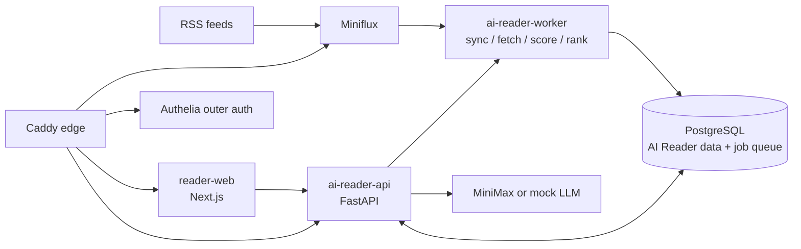

# Reno RSS / AI Reader

[English](README.md) | [中文](README.zh-CN.md)

[](https://github.com/blankhoney/reno_rss/actions/workflows/ci.yml)


AI Reader 是一个基于 Miniflux 的自托管 RSS 研究阅读工作台。
它把共享 RSS 订阅池变成带评分、解释和中文摘要的团队阅读队列。

## 在线 Demo

- Staging 应用：[https://staging-ai-reader.blankhoney.xyz/](https://staging-ai-reader.blankhoney.xyz/)
- 源码：[github.com/blankhoney/reno_rss](https://github.com/blankhoney/reno_rss)

打开 staging URL，输入显示名称，并保存登录后显示的恢复码。公开根路径只渲染 AI Reader 会话入口；文章数据和管理员操作仍由 FastAPI session 与 role 检查保护。

## 目录

- [背景](#背景)
- [功能](#功能)
- [架构](#架构)
- [仓库结构](#仓库结构)
- [环境要求](#环境要求)
- [安装](#安装)
- [配置](#配置)
- [使用](#使用)
- [本地检查](#本地检查)
- [部署](#部署)
- [CI/CD](#cicd)
- [维护者](#维护者)
- [贡献](#贡献)
- [安全](#安全)
- [许可证](#许可证)

## 背景

Miniflux 继续作为 RSS 抓取引擎和 entry 事实来源。AI Reader 负责产品层：用户、会话、收藏/已读状态、正文质量状态、评分批次、Top10 推荐版次、文章问答和管理员操作。

v0.4 架构围绕一个 FastAPI API、一个队列驱动 worker、一个 Next.js Web 应用展开。它不只是“带 AI 摘要的 RSS”，而是一个可重复的信息筛选、解释和项目线索管理系统。

## 功能

- **FastAPI 驱动的阅读工作台**：登录/恢复、文章列表/详情、收藏/已读状态、正文补全 job、推荐、管理员同步/评分、文章问答都通过同源 `/api/*`。
- **8 维评分 rubric**：`topic_relevance`、`information_density`、`source_quality`、`novelty`、`timeliness`、`actionability`、`reading_cost_fit`、`risk_uncertainty`。
- **可解释 Top10**：推荐版次保存 rank、tier、rank score、推荐理由、来源、风险标记和不确定性。
- **中文优先摘要和理由**：评分会写入中文摘要、原文摘要、标签、总理由、维度理由、confidence 和 risk flags。
- **专注阅读**：支持 HTML 净化、片段正文提示、正文刷新 job、快捷提问和 Markdown 渲染的助手回答。
- **流式文章问答**：`/api/articles/{id}/ask` 用 SSE 返回回答，并在展示前剥离模型推理块。
- **管理员操作台**：管理员可以触发 Miniflux 同步、创建有上限的评分批次、启动 job、轮询状态并回读批次详情。
- **staging runtime proof**：CI 会部署 staging，并用 mock LLM 跑 sync -> content fetch -> scoring -> recommendations -> ask SSE 链路证明。

## 架构



运行时服务：

- `reader-web`：Next.js UI，负责工作台、专注阅读、认证入口、Top10 和管理员控制台。
- `ai-reader-api`：FastAPI，负责 session、文章、状态、推荐、job、管理员 API 和 ask SSE。
- `ai-reader-worker`：Python 队列 worker，负责 Miniflux 同步、正文补全、评分批次和推荐生成。
- `miniflux`：RSS 抓取引擎和运维侧 feed 来源。
- `postgres`：Miniflux 数据库，以及 AI Reader schema、job queue、评分、推荐和用户状态。
- `caddy`：公网 HTTPS 反向代理和路由边界。
- `authelia`：页面路由的外层 forward-auth。

关键边界：Caddy 把 `/api/*` 直接路由到 FastAPI。FastAPI 用 `require_user` 和 `require_admin` 自己保护业务 API；页面仍可由 Authelia 做 defense in depth。

## 仓库结构

```text
apps/
  api/             FastAPI 应用、Alembic migration、OpenAPI 导出、API 测试
  worker/          Python job worker、排序/评分/同步逻辑、worker 测试
  reader-web/      Next.js UI、FastAPI client adapters、组件测试
infra/
  authelia/        Authelia 配置模板和占位用户库
  caddy/           公网入口路由
  compose/         Docker Compose base、edge、staging、prod overlay
  postgres/init/   初始数据库/用户 bootstrap
  scripts/         deploy、smoke-test、backup、restore、rollback、runtime proof
docs/
  spec/            v0.4 架构、数据模型、API、部署、安全规格
  runbooks/        备份恢复、部署、事故和回滚 runbook
.github/
  workflows/       CI、staging/prod 部署、回滚
  scripts/         GitHub Actions 远程部署辅助脚本
```

## 环境要求

- Docker 和 Docker Compose v2
- Node.js 22，用于 `apps/reader-web`
- Python 3.12 和 `uv`，用于 `apps/api` 与 `apps/worker`
- Miniflux 管理员账号
- 真实评分需要 MiniMax 凭据；测试和 staging proof 可用 `LLM_PROVIDER=mock`
- VPS/runtime secrets 保存在 Git 外

## 安装

克隆仓库并分别安装/验证各 app：

```bash
git clone https://github.com/blankhoney/reno_rss.git
cd reno_rss

cd apps/reader-web
npm ci

cd ../api
uv run --isolated --with-editable . --extra dev python -m pytest tests -q

cd ../worker
uv run --isolated --with-editable . --extra dev python -m pytest tests -q
```

部署配置从示例文件开始：

```bash
cp .env.example .env
```

不要提交生成的 `.env`。

## 配置

在 `.env` 或服务器本地 secret store 中填写这些配置组：

- 域名和 upstream：`DOMAIN`、`AI_READER_*_UPSTREAM`、`AI_READER_CSRF_ALLOWED_ORIGINS`
- 镜像：`IMAGE_REGISTRY`、`AI_READER_WEB_IMAGE`、`AI_READER_API_IMAGE`、`AI_READER_WORKER_IMAGE`
- Miniflux：`MINIFLUX_ADMIN`、`MINIFLUX_ADMIN_PASSWORD`、`MINIFLUX_DATABASE_URL`、`MINIFLUX_API_BASE_URL`、`MINIFLUX_API_KEY`
- PostgreSQL：`POSTGRES_*`、`SCORING_DATABASE_URL`
- Reader/API 默认值：`READER_TENANT_ID`、`READER_MINIFLUX_USER_ID`
- LLM 和 worker：`LLM_PROVIDER`、`MINIMAX_API_KEY`、`MINIMAX_BASE_URL`、`MINIMAX_MODEL`、`LLM_TIMEOUT_SECONDS`、`WORKER_CONCURRENCY`、`EXTERNAL_CONTENT_PROVIDER`
- staging 认证/展示标签：`DEMO_USERNAME`、`DEMO_PASSWORD`、`DEMO_AUTHELIA_BASE_URL`、`DEMO_TARGET_URL`、`DEMO_ALLOWED_ORIGIN`
- Authelia SMTP 和用户库：`SMTP_*`、`AUTHELIA_USERS_DATABASE_FILE`

真实 `.env`、Authelia 用户库、API key、SSH key 和 runtime secret 都不能进入 Git。

## 使用

常用本地命令：

```bash
# reader-web
cd apps/reader-web
npm test
npm run build

# api
cd apps/api
uv run --isolated --with-editable . --extra dev python -m pytest tests -q
uv run --isolated --with-editable . --extra dev ruff check .
uv run --isolated --with-editable . --extra dev python -m app.export_openapi --out openapi.json

# worker
cd apps/worker
uv run --isolated --with-editable . --extra dev python -m pytest tests -q
uv run --isolated --with-editable . --extra dev ruff check .
```

不覆盖本地 `.env` 的 Compose 配置验证：

```bash
docker compose --profile worker --env-file .env.example \
  -f infra/compose/docker-compose.base.yml \
  -f infra/compose/docker-compose.staging.yml config

docker compose --profile worker --env-file .env.example \
  -f infra/compose/docker-compose.base.yml \
  -f infra/compose/docker-compose.prod.yml config

docker compose --env-file .env.example \
  -f infra/compose/docker-compose.edge.yml config
```

## 本地检查

提交 tracked change 前，运行相关最小 gate，并始终跑：

```bash
git diff --check
```

按区域的最低检查：

- `apps/reader-web`：`npm test` 和 `npm run build`
- `apps/api`：通过 `uv run --isolated --with-editable . --extra dev` 运行 `python -m pytest tests -q` 和 `ruff check .`
- `apps/worker`：通过 `uv run --isolated --with-editable . --extra dev` 运行 `python -m pytest tests -q` 和 `ruff check .`
- Compose 或部署脚本：渲染受影响 overlay，并运行 `bash -n infra/scripts/*.sh .github/scripts/*.sh`

## 部署

部署脚本支持 `staging` 和 `prod`：

```bash
bash infra/scripts/deploy.sh staging sha-xxxxxxx
bash infra/scripts/deploy.sh prod sha-xxxxxxx
```

production 部署是手动且受保护的。生产路径必须在 migration 前完成备份 gate；除非故障明确是 schema/data 损坏，否则先回滚镜像，再考虑数据库恢复。

部署后 smoke：

```bash
bash infra/scripts/smoke-test.sh staging
bash infra/scripts/smoke-test.sh prod
```

staging CI 路径还会运行 `infra/scripts/staging-runtime-proof.sh`。当 API 和 worker 都使用 `LLM_PROVIDER=mock` 时，它会证明同步、正文补全、评分、推荐和问答链路；任一服务配置为真实 provider 时，会跳过 deep proof。

## CI/CD

GitHub Actions 提供：

- `ci.yml`：API 测试/lint、worker 测试/lint、OpenAPI 导出和 typed-client drift 检查、Alembic upgrade、reader-web 测试/构建、Compose 校验、部署脚本检查、Docker build、Trivy 扫描、GHCR 镜像发布，以及同仓库 PR 和 `main` push 的 staging 部署。
- `deploy-staging.yml`：按镜像 tag 手动部署 staging。
- `deploy-prod.yml`：通过 `production` environment 手动部署生产。
- `rollback.yml`：按旧 GHCR image tag 回滚 staging/prod。

发布的镜像：

- `ghcr.io/<owner>/reno_rss/ai-reader-web:sha-<short_sha>`
- `ghcr.io/<owner>/reno_rss/ai-reader-api:sha-<short_sha>`
- `ghcr.io/<owner>/reno_rss/ai-reader-worker:sha-<short_sha>`

完整交付行为见 [SPEC-CICD.zh-CN.md](SPEC-CICD.zh-CN.md)。

## 维护者

维护者：`blankhoney`。

运维 runbook 在 [docs/runbooks](docs/runbooks)。当前 v0.4 设计规格在 [docs/spec](docs/spec)。

## 贡献

这也是一个教学仓库。改代码前请阅读 [AGENTS.md](AGENTS.md) 和 repo-local plan 文件。优先做精确、可验证的改动，不做顺手大重构；当任务改变行为、架构、部署、流程或可复用调试知识时，更新 `docs/learning-notes.md`。

## 安全

- 不要提交真实 `.env`、Authelia 用户库、API key、SSH key、cookie 或 VPS runtime secret。
- `.env.example` 只能保留占位值。
- `/api/*` 路由到 FastAPI，匿名或非管理员请求必须按需要 fail closed。
- 文章 HTML 不可信，渲染前必须净化。
- 文章问答展示前会剥离 `<think>` 块。
- 自动 smoke/runtime proof 不能消耗真实 LLM token；deep runtime proof 只在 `LLM_PROVIDER=mock` 时运行。

## 许可证

MIT。详见 [LICENSE](LICENSE)。
