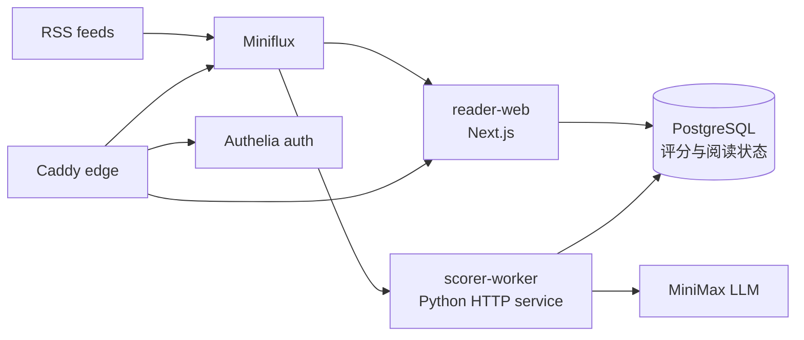

# Reno RSS / AI Reader

[English](README.md) | [中文](README.zh-CN.md)

AI Reader 是一个基于 Miniflux 的自托管 RSS 研究阅读工作台。它在传统 RSS 后端之上加入 LLM 多维评分、中文摘要、文章问答、专注阅读、订阅源质量治理，以及基于 GitHub Actions 的自动交付流程。

## 在线 Demo

- Demo 地址：[https://staging-ai-reader.blankhoney.xyz/](https://staging-ai-reader.blankhoney.xyz/)
- 源码地址：[github.com/blankhoney/reno_rss](https://github.com/blankhoney/reno_rss)

打开 Demo 后可以在首页点击“以游客身份进入”，无需提前知道账号密码。游客账号仅允许访问 staging AI Reader。

## 核心功能

- **统一 RSS 工作台**：Miniflux 继续作为订阅源和文章状态的事实数据源，AI Reader 负责更适合研究场景的阅读和筛选体验。
- **LLM 多维评分**：通过 MiniMax 从重要性、实用性、时效性、深度、技术价值、商业价值、趋势价值等维度评估文章。
- **中文优先摘要**：评分成功后生成中文摘要、原文摘要、评分理由和各维度理由。
- **专注阅读**：支持站内阅读、全文刷新、片段正文提示、Markdown 格式 AI 回答和文章助手抽屉。
- **研究工作流**：最新、未读、已读、候选、稍后读、已立项和评分维度模块组成“新到 -> 候选 -> 立项”的线索流。
- **订阅源质量治理**：根据最近文章完整率、评分和用户行为对低质量源降权，并支持手动隐藏/恢复，不直接删除 Miniflux 订阅。
- **公开体验入口**：staging 根路径提供公开 Landing，同源调用 Authelia demo 登录，同时 Caddy 只暴露必要入口。

## 工程亮点

- **小服务架构**：Next.js reader-web、Python scorer-worker、Miniflux、PostgreSQL、Caddy、Authelia 通过 Docker Compose overlay 分环境组织。
- **事件驱动评分**：scorer-worker 提供内部 HTTP 接口支持单篇实时评分和 Miniflux webhook 新文章评分，避免无差别定时全量扫描。
- **分层鉴权边界**：Caddy/Authelia 可作为公开 Demo 或 defense-in-depth 外层，业务路径的 session、role、CSRF 和限流由 app/API 自己强制。
- **自动交付**：GitHub Actions 覆盖测试、构建、Compose 校验、Trivy 扫描、GHCR 镜像发布、staging 部署、production 审批部署和回滚。
- **运维脚本完整**：`infra/scripts` 提供 deploy、smoke-test、backup、restore、rollback。

更详细的设计见 [TECHNICAL.zh-CN.md](TECHNICAL.zh-CN.md)。交付规格见 [SPEC-CICD.zh-CN.md](SPEC-CICD.zh-CN.md)。

## 架构



运行时服务：

- `reader-web`：AI Reader 页面和 API routes。
- `scorer-worker`：内部评分、Webhook 和单篇重评服务。
- `miniflux`：RSS 后端和订阅源事实数据。
- `postgres`：Miniflux 数据库，以及评分/阅读状态数据库。
- `caddy`：公网 HTTPS 反向代理。
- `authelia`：登录、2FA 和 forward-auth。

## 目录结构

```text
apps/
  reader-web/        Next.js AI Reader 页面和 API
  scorer-worker/    Python 评分服务和测试
infra/
  authelia/          Authelia 配置模板和占位用户库
  caddy/             公网入口路由
  compose/           Docker Compose base、edge、staging、prod 配置
  postgres/init/     数据库和用户初始化脚本
  scripts/           deploy、smoke-test、backup、restore、rollback
.github/
  workflows/         CI、staging/prod 部署、回滚
  scripts/           GitHub Actions 远程部署辅助脚本
```

## 环境要求

- Docker 和 Docker Compose v2
- Node.js 22，用于 `apps/reader-web`
- Python 3.12，用于 `apps/scorer-worker`
- Miniflux 管理员账号
- MiniMax API key
- VPS 或其他 Docker 运行环境
- 真实 secret 必须保存在服务器或 GitHub Secrets 中，不写入 Git

## 配置

复制示例环境变量：

```bash
cp .env.example .env
```

然后填写 `.env` 中的运行时配置：

- `DOMAIN`
- PostgreSQL 密码和数据库 URL
- Miniflux 管理员用户名/密码
- scorer webhook 用户名/密码
- MiniMax API key、base URL、model
- Authelia 邮件通知 SMTP 配置
- 可选 staging demo 配置，例如 `DEMO_USERNAME` 和 `DEMO_PASSWORD`

真实 secret 不应提交到 Git。Authelia 用户库可以通过 `AUTHELIA_USERS_DATABASE_FILE` 指向服务器本地文件，例如：

```text
/root/opt/myrss/secrets/users_database.yml
```

## 本地验证

Reader Web：

```bash
cd apps/reader-web
npm ci
npm test
npm run build
```

Scorer Worker：

```bash
cd apps/scorer-worker
python -m pip install -e ".[dev]"
python -m pytest tests -q
ruff check src/
```

Compose 配置验证：

```bash
cp .env.example .env
docker compose --profile worker --env-file .env \
  -f infra/compose/docker-compose.base.yml \
  -f infra/compose/docker-compose.staging.yml config

docker compose --profile worker --env-file .env \
  -f infra/compose/docker-compose.base.yml \
  -f infra/compose/docker-compose.prod.yml config
```

## 部署

部署脚本支持 `staging` 和 `prod`：

```bash
bash infra/scripts/deploy.sh staging sha-xxxxxxx
bash infra/scripts/deploy.sh prod sha-xxxxxxx
```

production 部署必须遵守 v0.4 闸门：先备份数据库并记录 artifact + SHA256，再执行 migration dry-run/upgrade，随后跑不改业务数据的 smoke；应用失败先回滚镜像，只有 schema/data 损坏时才按 runbook 恢复数据库。

部署模式：

- **本地构建模式**：在 VPS 上构建 `reader-web` 和 `scorer-worker` 镜像。
- **远程镜像模式**：从 GHCR 拉取指定 `IMAGE_TAG` 镜像，并通过 Compose `--no-build` 启动。

部署后 smoke test：

```bash
bash infra/scripts/smoke-test.sh staging
bash infra/scripts/smoke-test.sh prod
```

## CI/CD

GitHub Actions 提供：

- `ci.yml`：Python lint/test、reader-web test/build、Compose config 校验、Trivy 扫描、GHCR 镜像构建，以及同仓库 PR 和 `main` push 的 staging 自动部署。
- `deploy-staging.yml`：按镜像 tag 手动部署 staging，作为兜底入口。
- `deploy-prod.yml`：按镜像 tag 手动部署 production，并走 GitHub `production` environment。
- `rollback.yml`：按旧镜像 tag 回滚 staging/prod。

正常 staging 路径是 `push main -> checks -> GHCR images -> VPS pull -> smoke test`。常规交付不应再手动 SSH 到 VPS，除非是首次服务器就绪检查或故障恢复。

镜像 tag 必须与部署 revision 对齐，例如 `sha-7d59513`。完整交付要求见 [SPEC-CICD.zh-CN.md](SPEC-CICD.zh-CN.md)。

远程部署需要配置 GitHub Secrets：

- `VPS_HOST`
- `VPS_USER`
- `VPS_SSH_KEY` 或 `VPS_SSH_KEY_B64`
- `VPS_APP_DIR`
- `GHCR_USERNAME`
- `GHCR_TOKEN`

## 安全说明

- 不要提交真实 `.env`、API key、SSH key、Authelia 用户库或 VPS runtime secret。
- `.env.example` 只能保留占位值。
- scorer-worker 的写入接口只设计给 Docker 内网调用，并通过 Basic Auth 保护。
- 公网访问通过 Caddy 入口；Authelia 是公开 Demo 或 defense-in-depth 外层，业务鉴权必须由 app/API 自己执行。
- staging demo 密码是公开体验密码，不是生产 secret；仍建议按需轮换。
