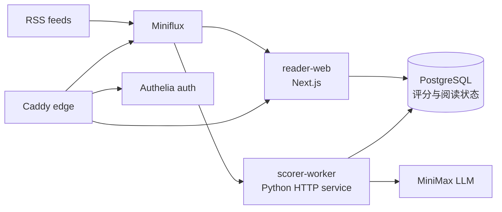

# Reno RSS / AI Reader

[English](README.md) | [中文](README.zh-CN.md)

AI Reader 是一个基于 Miniflux 的自托管 RSS 阅读工作台，在传统 RSS 聚合之上增加了 LLM 评分、中文摘要、文章问答、专注阅读、订阅源质量治理，以及 Docker/GitHub Actions 自动化部署流程。

项目面向个人研究和新闻信息流：RSS 条目进入 Miniflux 后，AI Reader 会读取文章、调用 MiniMax 进行多维评分，并在阅读界面中提供排序、摘要、过滤、候选/立项和 AI 辅助阅读能力。

## 核心功能

- **RSS 聚合**：使用 Miniflux 管理订阅源和文章状态，PostgreSQL 作为数据存储。
- **AI Reader Web**：基于 Next.js、React、TypeScript 构建阅读工作台和 API routes。
- **事件驱动评分服务**：Python scorer-worker 通过内部 HTTP 服务提供：
  - `GET /healthz`
  - `POST /internal/score-entry`
  - `POST /webhooks/miniflux`
- **LLM 能力**：接入 MiniMax，对文章生成总分、维度分、中文摘要、原文摘要、评分理由和问答上下文。
- **阅读工作流**：支持最新、未读、已读、候选、已立项、稍后读、技术、商业、趋势等模块。
- **专注阅读**：提供站内阅读页、全文刷新、文章问答、Markdown 回答渲染和片段正文提示。
- **订阅源质量治理**：根据最近文章完整率、评分、用户行为等信号对低质量源降权，并支持手动隐藏/恢复，不删除 Miniflux 订阅。
- **自托管部署**：Caddy 负责 HTTPS 入口，Authelia 负责登录鉴权，Docker Compose 区分 staging/prod 环境。
- **CI/CD**：GitHub Actions 负责测试、构建、GHCR 镜像发布、staging/prod 部署和回滚。

## 架构



运行时服务：

- `reader-web`：AI Reader 前端页面和 API routes。
- `scorer-worker`：内部评分、Webhook 和单篇重评服务。
- `miniflux`：RSS 后端和订阅源事实数据。
- `postgres`：Miniflux 数据库，以及评分/阅读状态数据库。
- `caddy`：公网 HTTPS 反向代理。
- `authelia`：登录鉴权和 forward-auth。

## 目录结构

```text
apps/
  reader-web/        Next.js AI Reader 页面和 API
  scorer-worker/    Python 评分服务和测试
infra/
  authelia/          Authelia 配置模板和占位用户库
  caddy/             公网入口路由
  compose/           Docker Compose base、edge、staging、prod 配置
  postgres/init/     数据库和用户初始化脚本
  scripts/           deploy、smoke-test、backup、restore、rollback
.github/
  workflows/         CI、staging/prod 部署、回滚
  scripts/           GitHub Actions 远程部署辅助脚本
```

## 环境要求

- Docker 和 Docker Compose v2
- Node.js 22，用于 `apps/reader-web`
- Python 3.12，用于 `apps/scorer-worker`
- Miniflux 管理员账号
- MiniMax API key
- VPS 或其他 Docker 运行环境
- 真实 secret 必须保存在服务器或 GitHub Secrets 中，不写入 Git

## 配置

复制示例环境变量：

```bash
cp .env.example .env
```

然后填写 `.env` 中的运行时配置：

- `DOMAIN`
- PostgreSQL 密码和数据库 URL
- Miniflux 管理员用户名/密码
- scorer webhook 用户名/密码
- MiniMax API key、base URL、model
- Authelia 邮件通知 SMTP 配置

真实 secret 不应提交到 Git。Authelia 用户库可以通过 `AUTHELIA_USERS_DATABASE_FILE` 指向服务器本地文件，例如：

```text
/root/opt/myrss/secrets/users_database.yml
```

## 本地验证

Reader Web：

```bash
cd apps/reader-web
npm ci
npm test
npm run build
```

Scorer Worker：

```bash
cd apps/scorer-worker
python -m pip install -e ".[dev]"
python -m pytest tests -q
ruff check src/
```

Compose 配置验证：

```bash
cp .env.example .env
docker compose --profile worker --env-file .env \
  -f infra/compose/docker-compose.base.yml \
  -f infra/compose/docker-compose.staging.yml config

docker compose --profile worker --env-file .env \
  -f infra/compose/docker-compose.base.yml \
  -f infra/compose/docker-compose.prod.yml config
```

## 部署

部署脚本支持 `staging` 和 `prod`：

```bash
bash infra/scripts/deploy.sh staging sha-xxxxxxx
bash infra/scripts/deploy.sh prod sha-xxxxxxx
```

部署模式：

- **本地构建模式**：在 VPS 上构建 `reader-web` 和 `scorer-worker` 镜像。
- **远程镜像模式**：从 GHCR 拉取指定 `IMAGE_TAG` 镜像，并通过 Compose `--no-build` 启动。

部署后 smoke test：

```bash
bash infra/scripts/smoke-test.sh staging
bash infra/scripts/smoke-test.sh prod
```

## CI/CD

GitHub Actions 提供：

- `ci.yml`：Python lint/test、reader-web test/build、Compose config 校验、Trivy 扫描、GHCR 镜像构建和同仓库 PR 的 staging 部署。
- `deploy-staging.yml`：按镜像 tag 手动部署 staging。
- `deploy-prod.yml`：按镜像 tag 手动部署 production，并走 GitHub `production` environment。
- `rollback.yml`：按旧镜像 tag 回滚 staging/prod。

远程部署需要配置 GitHub Secrets：

- `VPS_HOST`
- `VPS_USER`
- `VPS_SSH_KEY` 或 `VPS_SSH_KEY_B64`
- `VPS_APP_DIR`
- `GHCR_USERNAME`
- `GHCR_TOKEN`

## 安全说明

- 不要提交真实 `.env`、API key、SSH key、Authelia 用户库或 VPS runtime secret。
- `.env.example` 只能保留占位值。
- scorer-worker 的写入接口只设计给 Docker 内网调用，并通过 Basic Auth 保护。
- 公网访问通过 Caddy 入口和 Authelia 鉴权。

