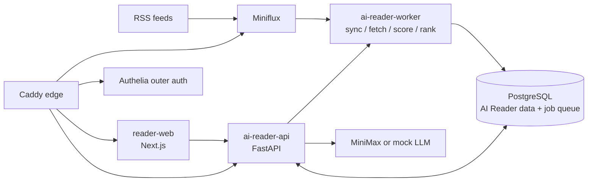

<p align="center">
  
</p>

<h1 align="center">AI Reader</h1>

<p align="center">
  <strong>一个基于 Miniflux 的自托管 RSS 研究阅读工作台，把订阅源变成可评分、可解释、中文优先的阅读队列。</strong>
</p>

<p align="center">
  <a href="README.md">English</a>
  ·
  <a href="https://staging-ai-reader.blankhoney.xyz/">在线 Demo</a>
  ·
  <a href="#亮点">亮点</a>
  ·
  <a href="#架构">架构</a>
  ·
  <a href="#快速开始">快速开始</a>
  ·
  <a href="#部署">部署</a>
</p>

<p align="center">
  <a href="https://github.com/blankhoney/reno_rss/actions/workflows/ci.yml"></a>
  
  
  
  
  
</p>

AI Reader 在 Miniflux 之上增加产品层。Miniflux 继续作为 RSS 抓取引擎和 entry 事实来源；AI Reader 负责 session、文章状态、评分批次、Top10 推荐版次、文章问答和管理员操作。

当前 v0.4 架构由一个 FastAPI API、一个队列驱动的 Python worker、一个 Next.js Web 应用组成。它面向小型研究团队：从大量订阅源里筛出值得读的文章，解释为什么值得读，并把信息线索转成项目或学习输入。

## 在线 Demo

- Staging 应用：[https://staging-ai-reader.blankhoney.xyz/](https://staging-ai-reader.blankhoney.xyz/)
- 源码：[github.com/blankhoney/reno_rss](https://github.com/blankhoney/reno_rss)

staging 是完整公开的功能 demo：打开 URL 后，匿名访客会由 FastAPI 映射到共享的 demo 普通用户，不经 Authelia 即可使用工作台与阅读页；管理员 API 仍受 role 保护，并对该 demo 用户返回 `403`。访客若需要独立 session，仍可使用显示名称登录与恢复码；production 保留 Caddy/Authelia 页面边界，且不启用共享 demo 用户。

## 亮点

| 区域 | AI Reader 提供什么 |
| --- | --- |
| 阅读工作台 | 通过同源 `/api/*` 访问文章列表、详情页、收藏/已读状态、正文刷新 job、推荐和文章问答。 |
| 评分 rubric | 八个维度：`topic_relevance`、`information_density`、`source_quality`、`novelty`、`timeliness`、`actionability`、`reading_cost_fit`、`risk_uncertainty`。 |
| 可解释 Top10 | 推荐版次保存 rank、tier、rank score、推荐理由、来源、风险标记和不确定性。 |
| 中文优先输出 | 评分会保存中文摘要、原文摘要、标签、总理由、维度理由、confidence 和 risk flags。 |
| 专注阅读 | 支持 HTML 净化、片段正文提示、正文刷新 job、快捷提问和 Markdown 渲染的助手回答。 |
| 流式问答 | `/api/articles/{id}/ask` 使用 Server-Sent Events 返回，并在展示前剥离模型推理块。 |
| 管理员控制台 | 管理员可以触发 Miniflux 同步、创建有上限的评分批次、启动 job、轮询状态并回读批次详情。 |
| runtime proof | staging CI 可用 mock LLM 证明 sync、正文补全、评分、推荐和 ask SSE 链路，不消耗真实 LLM token。 |

## 架构


```mermaid
flowchart LR
  RSS[RSS feeds] --> Miniflux[Miniflux]
  Miniflux --> Worker[ai-reader-worker<br/>sync / fetch / score / rank]
  Worker --> DB[(PostgreSQL<br/>AI Reader data + job queue)]
  API[ai-reader-api<br/>FastAPI] <--> DB
  API --> Worker
  API --> LLM[MiniMax or mock LLM]
  Web[reader-web<br/>Next.js] --> API
  Caddy[Caddy edge] --> Web
  Caddy --> API
  Caddy --> Miniflux
  Caddy --> Authelia[Authelia outer auth]
```

| 运行时服务 | 职责 |
| --- | --- |
| `reader-web` | Next.js UI，负责工作台、专注阅读、认证入口、Top10 侧栏和管理员控制台。 |
| `ai-reader-api` | FastAPI，负责 session、文章、状态、推荐、job、管理员 API 和 ask SSE。 |
| `ai-reader-worker` | Python 队列 worker，负责 Miniflux 同步、正文补全、评分批次、翻译和推荐生成。 |
| `miniflux` | RSS 抓取引擎和运维侧 feed 来源。 |
| `postgres` | Miniflux 数据，以及 AI Reader schema、job queue、评分、推荐、session 和用户状态。 |
| `caddy` | 公网 HTTPS 反向代理和路由边界。 |
| `authelia` | 受保护页面路由的可选外层 forward-auth。 |

关键边界：Caddy 把 `/api/*` 直接路由到 FastAPI。业务 API 必须在 FastAPI 内执行 `require_user` 和 `require_admin`。staging 有意把匿名请求映射为一个 role=`user` 的 demo 身份，并公开页面路由；production 关闭匿名 demo，页面继续由 Authelia 保护。

## 仓库地图

```text
apps/
  api/             FastAPI 应用、Alembic migration、OpenAPI 导出、API 测试
  worker/          Python job worker、评分/排序/同步/翻译逻辑
  reader-web/      Next.js UI、生成的 FastAPI client adapters、组件测试
infra/
  authelia/        Authelia 配置模板和占位用户库
  caddy/           公网入口路由
  compose/         Docker Compose base、edge、staging、production overlay
  postgres/init/   初始数据库/用户 bootstrap
  scripts/         deploy、smoke-test、backup、restore、rollback、runtime proof
.github/
  workflows/       CI、staging/prod 部署、回滚
  scripts/         GitHub Actions 远程部署辅助脚本
```

公开架构和交付说明见 [TECHNICAL.zh-CN.md](TECHNICAL.zh-CN.md) 与 [SPEC-CICD.zh-CN.md](SPEC-CICD.zh-CN.md)。`docs/` 下的本地学习笔记和其他本地运营材料继续被忽略；active operator runbook [`docs/runbooks/deploy.md`](docs/runbooks/deploy.md) 和 [`docs/runbooks/rollback.md`](docs/runbooks/rollback.md) 已 tracked，并是当前 request-only 指引。

## 快速开始

环境要求：

- Docker 和 Docker Compose v2
- Node.js 22，用于 `apps/reader-web`
- Python 3.12 和 `uv`，用于 `apps/api` 与 `apps/worker`
- Miniflux 管理员账号
- 真实评分需要 MiniMax 凭据；测试和 staging proof 可使用 `LLM_PROVIDER=mock`

克隆仓库并验证三个应用面：

```bash
git clone https://github.com/blankhoney/reno_rss.git
cd reno_rss

cd apps/reader-web
npm ci
npm test
npm run build

cd ../api
uv run --isolated --with-editable . --extra dev python -m pytest tests -q

cd ../worker
uv run --isolated --with-editable . --extra dev python -m pytest tests -q
```

从 tracked 示例创建本地 runtime 配置：

```bash
cp .env.example .env
chmod 600 .env
```

不要提交生成的 `.env`，并只允许文件 owner 读取。

## 配置

在 `.env` 或服务器本地 secret store 中填写这些配置组：

| 分组 | 示例变量 |
| --- | --- |
| 域名和路由 | `DOMAIN`、`AI_READER_*_UPSTREAM`、`AI_READER_CSRF_ALLOWED_ORIGINS`、`AI_READER_ANONYMOUS_DEMO` |
| 镜像 | `IMAGE_REGISTRY`、`AI_READER_WEB_IMAGE`、`AI_READER_API_IMAGE`、`AI_READER_WORKER_IMAGE` |
| Miniflux | `MINIFLUX_ADMIN`、`MINIFLUX_ADMIN_PASSWORD`、`MINIFLUX_DATABASE_URL`、`MINIFLUX_API_BASE_URL`、`MINIFLUX_API_KEY` |
| PostgreSQL | `POSTGRES_*`、`SCORING_DATABASE_URL` |
| Reader/API 默认值 | `READER_TENANT_ID`、`READER_MINIFLUX_USER_ID` |
| LLM、API 安全和 worker | `LLM_PROVIDER`、`MINIMAX_API_KEY`、`MINIMAX_BASE_URL`、`MINIMAX_MODEL`、`LLM_TIMEOUT_SECONDS`、`LLM_DAILY_CALL_BUDGET`、`LLM_RATELIMIT`、`WRITE_RATELIMIT`、`AUTH_RATELIMIT`、`API_RATELIMIT_DEFAULT`、`WORKER_CONCURRENCY`、`WORKER_POLL_SECONDS`、`WORKER_JOB_LEASE_SECONDS`、`WORKER_RETRY_BACKOFF_SECONDS`、`WORKER_RETRY_BACKOFF_MAX_SECONDS`、`WORKER_LOG_LEVEL`、`EXTERNAL_CONTENT_PROVIDER` |
| staging 展示标签 | `DEMO_USERNAME`、`DEMO_PASSWORD`、`DEMO_AUTHELIA_BASE_URL`、`DEMO_TARGET_URL`、`DEMO_ALLOWED_ORIGIN` |
| Authelia | `SMTP_*`、`AUTHELIA_USERS_DATABASE_FILE` |

真实 `.env`、Authelia 用户库、API key、SSH key、cookie 和 runtime secret 都不能进入 Git。

## 开发

常用本地检查：

```bash
# reader-web
cd apps/reader-web
npm test
npm run build

# api
cd apps/api
uv run --isolated --with-editable . --extra dev python -m pytest tests -q
uv run --isolated --with-editable . --extra dev ruff check .
uv run --isolated --with-editable . --extra dev python -m app.export_openapi --out openapi.json

# worker
cd apps/worker
uv run --isolated --with-editable . --extra dev python -m pytest tests -q
uv run --isolated --with-editable . --extra dev ruff check .
```

不覆盖本地 `.env` 的 Compose overlay 渲染：

```bash
docker compose --profile worker --env-file .env.example \
  -f infra/compose/docker-compose.base.yml \
  -f infra/compose/docker-compose.staging.yml config

docker compose --profile worker --env-file .env.example \
  -f infra/compose/docker-compose.base.yml \
  -f infra/compose/docker-compose.prod.yml config

docker compose --env-file .env.example \
  -f infra/compose/docker-compose.edge.yml config
```

提交 tracked edit 前始终运行：

```bash
git diff --check
```

## 部署

当前三个手工部署 workflow 是 request-only。GitHub 仍从用户选定的 dispatch ref 加载 workflow YAML，但 request job 不 checkout 或执行目标 repository code、不读取部署 secret、不申请 environment 审批、不 SSH 到 VPS，也不执行 `infra/scripts/deploy.sh` / `rollback.sh`。负责消费 artifact 并执行携带 secret 部署的 trusted orchestrator 尚未启用，因此创建 request 不会自动部署或回滚环境；未来 orchestrator 必须先校验 workflow-run/ref/artifact provenance。

常规 staging 路径仍是 `ci.yml` 在检查和镜像发布后的 `main` push 路径。不要把直接 SSH 或 `infra/scripts/deploy.sh` / `rollback.sh` 命令当作 request 的常规替代；这些命令只作为归档的授权 break-glass 知识，必须另有事故授权。

手工 request 输入：

- `deploy-staging.yml` 和 `deploy-prod.yml`：`image_tag` 加匹配的完整 40 位小写 `deploy_sha`。
- `rollback.yml`：`env`（`staging` 或 `prod`）、`image_tag` 和匹配的完整 `deploy_sha`。
- `image_tag` 必须是 `sha-<7 位小写十六进制>`，并匹配 `deploy_sha` 前七位。不接受 `git_ref`。

每个 request artifact 使用固定的 `trusted-deploy-request/v1` schema，且只含 `schema_version`、`request_type`、`environment`、`image_tag` 和 `deploy_sha`。固定 artifact 名称为 `trusted-staging-deploy-request`、`trusted-production-deploy-request` 和 `trusted-rollback-request`。artifact 是数据，不能执行其内容。

只有在独立的 trusted path 报告部署确实完成后，才运行 smoke 检查；这些命令不会部署：

```bash
bash infra/scripts/smoke-test.sh staging
bash infra/scripts/smoke-test.sh prod
```

GitHub Actions 提供：

- `ci.yml`：API 测试/lint、worker 测试/lint、OpenAPI 导出和 typed-client drift 检查、Alembic upgrade、reader-web 测试/构建、Compose 校验、部署脚本检查、Docker build、显式 Trivy 漏洞/secret 扫描、GHCR 镜像发布，以及常规 staging 部署路径。
- `deploy-staging.yml`：按 immutable image tag 和完整 deploy SHA 创建 staging request。
- `deploy-prod.yml`：创建 production request；只有 trusted orchestrator 启用并应用 `production` 审批后才会部署。
- `rollback.yml`：按 immutable image tag 和完整 deploy SHA 创建 staging/prod rollback request。

完整交付行为见 [SPEC-CICD.zh-CN.md](SPEC-CICD.zh-CN.md)。

## 安全

- 不要提交真实 `.env`、Authelia 用户库、API key、SSH key、cookie 或 VPS runtime secret。
- `.env.example` 只能保留占位值。
- `/api/*` 路由到 FastAPI，匿名或非管理员请求必须按需要 fail closed。
- 公开 auth、写接口和 LLM 接口有应用层限流；直接 ask 调用在每日 LLM 预算耗尽后会降级为 deterministic 回答。
- Caddy 会在 reader/auth/API 路由上添加基础浏览器安全响应头。
- 文章 HTML 不可信，渲染前必须净化。
- 文章问答展示前会剥离 `<think>` 块。
- 自动 smoke/runtime proof 不能消耗真实 LLM token；deep runtime proof 只在 `LLM_PROVIDER=mock` 时运行。

## 贡献

这也是一个教学仓库。优先做精确、可验证的改动，不做顺手大重构；公开文档要与 [TECHNICAL.zh-CN.md](TECHNICAL.zh-CN.md) 对齐；当任务改变行为、架构、部署、流程或可复用调试知识时，更新本地学习笔记。

## 许可证

[MIT](LICENSE)
