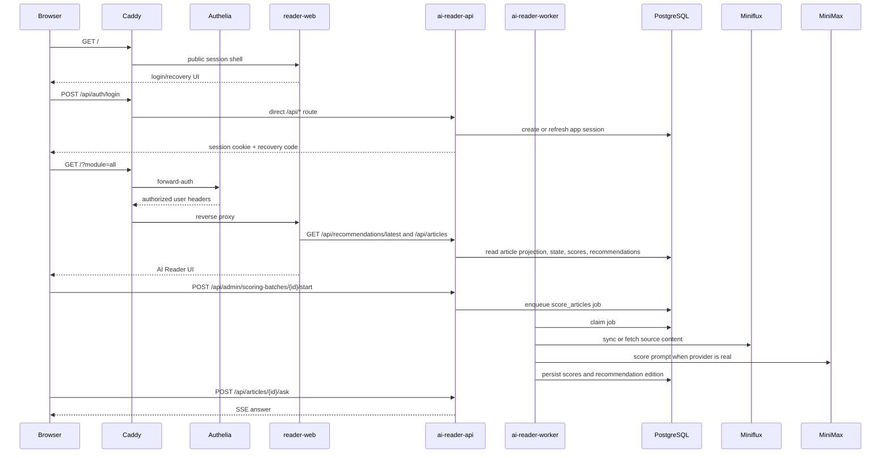

# Technical Architecture

[English](TECHNICAL.md) | [中文](TECHNICAL.zh-CN.md)

This document describes the public, repository-tracked architecture of Reno RSS / AI Reader. Local agent notes remain outside Git and are intentionally not stored under `docs/`.

## System Overview

AI Reader is a self-hosted RSS research system with seven runtime services:

- **Caddy** terminates public HTTPS traffic and applies route-level routing boundaries.
- **Authelia** provides login, 2FA, forward-auth, and the staging demo account policy for protected web pages.
- **Miniflux** stores feeds, entries, and upstream RSS state.
- **reader-web** is a Next.js app that renders the AI Reader UI and talks to the FastAPI backend through same-origin `/api/*`.
- **ai-reader-api** is a FastAPI service for sessions, article state, recommendations, jobs, admin APIs, and article ask SSE.
- **ai-reader-worker** is a Python queue worker for Miniflux sync, content fetching, scoring batches, and recommendation generation.
- **PostgreSQL** stores Miniflux data plus AI Reader sessions, jobs, scores, recommendations, article state, and feed governance data.

## Request Flow



## Data Model Boundaries

- Miniflux remains the upstream source of truth for feeds, entries, original URLs, and RSS metadata.
- AI Reader stores local sessions, article projections, and derived workflow state:
  - article scores and score reasons
  - Chinese summaries and source-content quality
  - read, saved, and progress state
  - recommendation editions and Top10 ranks
  - job queue state
  - feed preferences and hidden flags
- `reader-web` does not read Miniflux or PostgreSQL directly. Its data boundary is the generated FastAPI client under `apps/reader-web/src/lib/api`.
- `/api/*` routes bypass Authelia at Caddy and must fail closed inside FastAPI through `require_user` and `require_admin`.

## Worker and LLM Flow

The queue worker handles durable jobs, not HTTP requests. The primary job types are:

- `sync_miniflux`
- `fetch_content`
- `score_articles`
- `generate_recommendations`

Scoring is triggered from the admin console through FastAPI:

- an admin enqueues a sync or scoring batch
- FastAPI writes a job to PostgreSQL
- the worker claims the job and performs Miniflux, content-fetch, LLM, and recommendation work
- reader-web polls `/api/jobs/{id}` and reads the resulting article, batch, or recommendation state

The LLM response is parsed into the v0.4 eight-dimension rubric (`topic_relevance`, `information_density`, `source_quality`, `novelty`, `timeliness`, `actionability`, `reading_cost_fit`, `risk_uncertainty`) plus summaries and reasons. CI and staging proof use `LLM_PROVIDER=mock` unless the operator deliberately enables a real provider.

## Content and Rendering Safety

- Article HTML is sanitized before rendering because RSS and fetched source content are untrusted.
- Article links open in a new tab with safe `rel` attributes.
- Agent answers are rendered through a lightweight Markdown renderer that does not render raw HTML.
- Agent API input is length-limited server-side, and model `<think>...</think>` blocks are stripped before display.

## Public Demo Boundary

The staging demo is intentionally narrow:

- `GET /` with an empty query renders the public AI Reader session shell.
- `/_next/static/*` and `/favicon.ico` are public for that shell.
- Business page routes such as `/?module=all` and `/read/*` still pass through Authelia forward-auth.
- `/api/*` routes go directly to FastAPI. Anonymous article/admin calls must fail closed there; login and recovery are handled by `/api/auth/login` and `/api/auth/recover`.

The public shell asks for a display name and returns a one-time recovery code from FastAPI. It no longer uses the retired one-click reader-web demo route.

## CI/CD and Deployment

The delivery path is:

1. GitHub Actions run API tests/lint, worker tests/lint, OpenAPI drift checks, reader-web tests/build, Compose validation, deploy-script checks, and Trivy scanning.
2. GHCR images are built for `ai-reader-web`, `ai-reader-api`, and `ai-reader-worker`.
3. Staging is deployed automatically from same-repository PRs and `main` pushes.
4. Production deploy is manual and should be protected by the GitHub `production` environment.
5. Rollback uses a previous GHCR image tag with the same remote deploy path.

The VPS keeps runtime `.env` and secret files locally. GitHub Actions only pass deployment metadata and GHCR credentials needed for image pulls.

`deploy-staging.yml` remains available as a manual fallback by explicit image tag. The normal staging path and acceptance criteria are specified in [SPEC-CICD.md](SPEC-CICD.md).

## Security Notes

- Real `.env`, Authelia users, API keys, and SSH keys must stay out of Git.
- The tracked Authelia user database is only a placeholder.
- Staging demo Authelia labels are public staging affordances, not production secrets.
- FastAPI is the authority for `/api/*` authorization; Caddy routes those requests directly to the API service.
- Caddy and Authelia remain the page-route access-control boundary for protected web pages.
- High/critical dependency advisories should fail CI; vulnerability ignores must stay empty unless there is an explicit reviewed reason.

## Verification Commands

```bash
cd apps/reader-web
npm test
npm run build
```

```bash
cd apps/api
uv run --isolated --with-editable . --extra dev python -m pytest tests -q
```

```bash
cd apps/worker
python -m pytest tests -q
```

```bash
docker compose --profile worker --env-file .env.example \
  -f infra/compose/docker-compose.base.yml \
  -f infra/compose/docker-compose.staging.yml config
```

```bash
git diff --check
```
