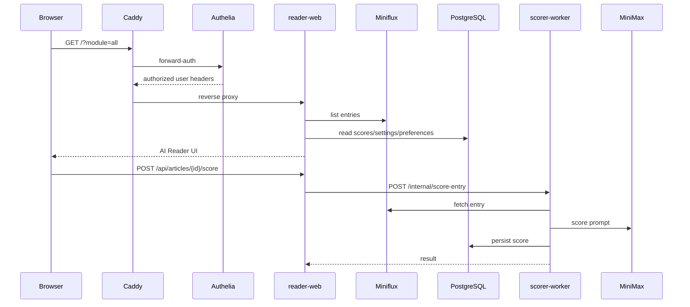

# Technical Architecture

[English](TECHNICAL.md) | [中文](TECHNICAL.zh-CN.md)

This document describes the public, repository-tracked architecture of Reno RSS / AI Reader. Local agent notes remain outside Git and are intentionally not stored under `docs/`.

## System Overview

AI Reader is a self-hosted RSS research system with six runtime services:

- **Caddy** terminates public HTTPS traffic and applies route-level auth boundaries.
- **Authelia** provides login, 2FA, forward-auth, and the staging demo account policy.
- **Miniflux** stores feeds, entries, and upstream RSS state.
- **reader-web** is a Next.js app that renders the AI Reader UI and exposes server-side API routes.
- **scorer-worker** is a Python HTTP service for article scoring and Miniflux webhook processing.
- **PostgreSQL** stores Miniflux data plus scoring, reader state, settings, project queue, and feed preferences.

## Request Flow



## Data Model Boundaries

- Miniflux remains the source of truth for feeds, entries, read state, starred state, and original URLs.
- AI Reader stores derived or local workflow state:
  - article scores and score reasons
  - Chinese/original summaries
  - scoring settings
  - read-later state
  - project queue state
  - feed preferences and hidden flags
- The scorer-worker and reader-web share the scoring database but keep network responsibilities separate.

## LLM Scoring Flow

The scorer-worker exposes:

- `GET /healthz`
- `POST /internal/score-entry`
- `POST /webhooks/miniflux`

Scoring is event-driven or user-triggered:

- new entries can be scored by Miniflux webhook
- a user can manually rescore one article
- the UI can rescore the first N articles on the current page with client-side concurrency control

The LLM response is parsed into structured scores, summaries, and dimension reasons. Baseline/error rows are treated as failed scoring and are hidden from score-based ranking.

## Content and Rendering Safety

- Article HTML is sanitized before rendering because RSS and fetched source content are untrusted.
- Article links open in a new tab with safe `rel` attributes.
- Agent answers are rendered through a lightweight Markdown renderer that does not render raw HTML.
- Agent API input is length-limited server-side, and model `<think>...</think>` blocks are stripped before display.

## Public Demo Boundary

The staging demo is intentionally narrow:

- `GET /` with an empty query renders a public landing page.
- `POST /api/demo-login` performs same-origin demo login.
- `/_next/static/*` and `/favicon.ico` are public for the landing page.
- Business paths such as `/?module=all`, `/read/*`, `/api/articles*`, and `/api/agent*` still require Authelia.

`/api/demo-login` reads demo credentials from server environment variables, validates the staging origin, calls Authelia `/api/firstfactor`, forwards Authelia session cookies, and redirects to the protected workspace. It does not accept client-provided usernames, passwords, or target URLs.

## CI/CD and Deployment

The delivery path is:

1. GitHub Actions run Python tests/lint, reader-web tests/build, Compose validation, and Trivy scanning.
2. GHCR images are built for `reader-web` and `scorer-worker`.
3. Staging can be deployed automatically from same-repository PRs or manually by image tag.
4. Production deploy is manual and should be protected by the GitHub `production` environment.
5. Rollback uses a previous GHCR image tag with the same remote deploy path.

The VPS keeps runtime `.env` and secret files locally. GitHub Actions only pass deployment metadata and GHCR credentials needed for image pulls.

## Security Notes

- Real `.env`, Authelia users, API keys, and SSH keys must stay out of Git.
- The tracked Authelia user database is only a placeholder.
- Demo credentials are public staging credentials, not production secrets.
- Internal scorer endpoints should not be exposed publicly.
- Caddy and Authelia are the public access-control boundary; reader-web assumes the edge protects business routes.
- High/critical dependency advisories should fail CI; vulnerability ignores must stay empty unless there is an explicit reviewed reason.

## Verification Commands

```bash
cd apps/reader-web
npm test
npm run build
```

```bash
cd apps/scorer-worker
python -m pytest tests -q
```

```bash
docker compose --profile worker --env-file .env.example \
  -f infra/compose/docker-compose.base.yml \
  -f infra/compose/docker-compose.staging.yml config
```

```bash
git diff --check
```
