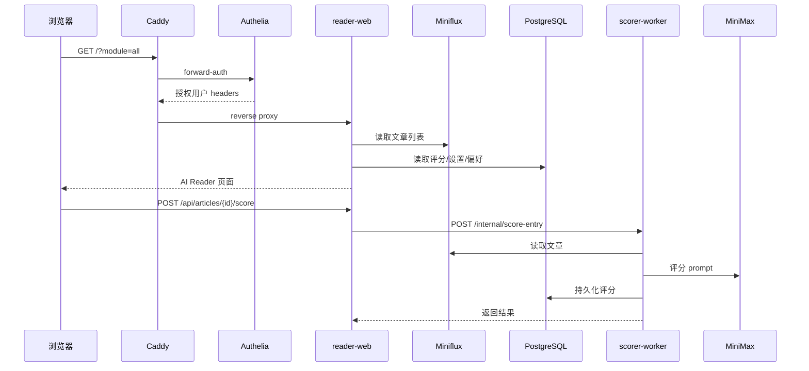

# 技术架构

[English](TECHNICAL.md) | [中文](TECHNICAL.zh-CN.md)

本文档描述 Reno RSS / AI Reader 可以公开展示的系统架构。个人 agent 笔记和学习材料继续保留在本地，不放入 Git，也不放在已忽略的 `docs/` 目录下作为公开文档。

## 系统概览

AI Reader 是一个自托管 RSS 研究系统，运行时由六类服务组成：

- **Caddy**：公网 HTTPS 入口，负责反向代理和路由级鉴权边界。
- **Authelia**：负责登录、2FA、forward-auth 和 staging demo 账号访问策略。
- **Miniflux**：存储订阅源、文章条目和 RSS 原始状态。
- **reader-web**：Next.js 应用，提供 AI Reader 页面和服务端 API routes。
- **scorer-worker**：Python HTTP 服务，负责文章评分和 Miniflux webhook 处理。
- **PostgreSQL**：存储 Miniflux 数据，以及评分、阅读状态、设置、立项队列和订阅源偏好。

## 请求链路



## 数据边界

- Miniflux 是订阅源、文章、已读状态、星标状态和原始 URL 的事实数据源。
- AI Reader 只保存派生数据和本地工作流状态：
  - 文章评分和评分理由
  - 中文摘要和原文摘要
  - 评分设置
  - 稍后读状态
  - 已立项队列
  - 订阅源偏好和隐藏状态
- scorer-worker 和 reader-web 共享评分数据库，但网络职责分离：reader-web 面向用户请求，scorer-worker 面向内部评分和 webhook。

## LLM 评分链路

scorer-worker 暴露三个内部接口：

- `GET /healthz`
- `POST /internal/score-entry`
- `POST /webhooks/miniflux`

评分由事件或用户动作触发：

- Miniflux webhook 可触发新文章评分
- 用户可手动重评单篇文章
- UI 可按当前列表顺序重评前 N 篇，并在前端限制并发

LLM 输出会被解析为结构化分数、摘要和维度理由。baseline/error 行会被视为评分失败，不参与评分排序展示。

## 内容渲染安全

- RSS 正文和抓取到的源站正文都属于不可信输入，渲染前必须经过 HTML sanitize。
- 正文外链新标签打开，并带安全 `rel` 属性。
- Agent 回答通过轻量 Markdown 渲染，不执行原始 HTML。
- Agent API 在服务端限制输入长度，并在展示前移除模型 `<think>...</think>` 推理块。

## 公开 Demo 边界

staging demo 的公开面保持最小：

- 空 query 的 `GET /` 展示公开 Landing。
- `POST /api/demo-login` 执行同源 demo 登录。
- `/_next/static/*` 和 `/favicon.ico` 对 Landing 公开。
- `/?module=all`、`/read/*`、`/api/articles*`、`/api/agent*` 等业务路径仍必须通过 Authelia。

`/api/demo-login` 只从服务端环境变量读取 demo 凭据，校验 staging origin，调用 Authelia `/api/firstfactor`，转发 Authelia session cookie，并跳转到受保护工作台。该接口不接受客户端传入用户名、密码或跳转目标。

## CI/CD 与部署

交付链路：

1. GitHub Actions 执行 Python test/lint、reader-web test/build、Compose 校验和 Trivy 扫描。
2. 构建 `reader-web` 和 `scorer-worker` GHCR 镜像。
3. staging 在同仓库 PR 和 `main` push 后自动部署。
4. production 只支持手动部署，建议通过 GitHub `production` environment 审批。
5. rollback 使用旧 GHCR 镜像 tag，复用同一套远程部署脚本。

VPS 上的 `.env` 和 secret 文件由服务器本地保存。GitHub Actions 只传递部署元数据和拉取私有镜像所需的 GHCR 凭据。

`deploy-staging.yml` 保留为按 image tag 手动部署的兜底入口。正常 staging 交付路径和验收标准见 [SPEC-CICD.zh-CN.md](SPEC-CICD.zh-CN.md)。

## 安全说明

- 真实 `.env`、Authelia 用户库、API key、SSH key 不进入 Git。
- Git 中的 Authelia 用户库只是占位模板。
- Demo 凭据是公开 staging 体验凭据，不是生产 secret。
- scorer-worker 内部写接口不应暴露到公网。
- Caddy 和 Authelia 是公网访问控制边界；reader-web 默认业务路径已由边缘层保护。
- CI 应对 high/critical 依赖漏洞失败；除非有明确 review 结论，否则不保留漏洞忽略项。

## 验证命令

```bash
cd apps/reader-web
npm test
npm run build
```

```bash
cd apps/scorer-worker
python -m pytest tests -q
```

```bash
docker compose --profile worker --env-file .env.example \
  -f infra/compose/docker-compose.base.yml \
  -f infra/compose/docker-compose.staging.yml config
```

```bash
git diff --check
```
