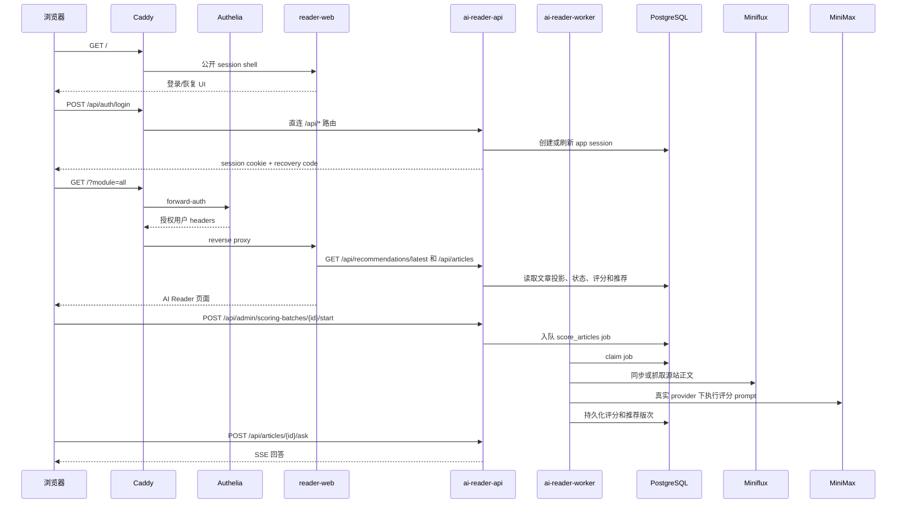

# 技术架构

[English](TECHNICAL.md) | [中文](TECHNICAL.zh-CN.md)

本文档描述 Reno RSS / AI Reader 可以公开展示的系统架构。个人 agent 笔记和学习材料继续保留在本地，不放入 Git，也不放在已忽略的 `docs/` 目录下作为公开文档。

## 系统概览

AI Reader 是一个自托管 RSS 研究系统，运行时由七类服务组成：

- **Caddy**：公网 HTTPS 入口，负责反向代理和路由边界。
- **Authelia**：负责登录、2FA、forward-auth，以及 staging 受保护页面的 demo 账号访问策略。
- **Miniflux**：存储订阅源、文章条目和 RSS 上游状态。
- **reader-web**：Next.js 应用，渲染 AI Reader UI，并通过同源 `/api/*` 调用 FastAPI 后端。
- **ai-reader-api**：FastAPI 服务，负责 session、文章状态、推荐、job、管理员 API 和文章问答 SSE。
- **ai-reader-worker**：Python 队列 worker，负责 Miniflux 同步、正文补全、评分批次和推荐生成。
- **PostgreSQL**：存储 Miniflux 数据，以及 AI Reader session、job、评分、推荐、文章状态和订阅源治理数据。

## 请求链路



## 数据边界

- Miniflux 是订阅源、文章、原始 URL 和 RSS metadata 的上游事实数据源。
- AI Reader 保存本地 session、文章投影和派生工作流状态：
  - 文章评分和评分理由
  - 中文摘要和源站正文质量
  - 已读、收藏和阅读进度状态
  - 推荐版次和 Top10 排名
  - job 队列状态
  - 订阅源偏好和隐藏状态
- `reader-web` 不再直接读取 Miniflux 或 PostgreSQL。它的数据边界是 `apps/reader-web/src/lib/api` 下的 FastAPI generated client/adapters。
- Caddy 对 `/api/*` 不走 Authelia，而是直接转到 FastAPI；FastAPI 必须通过 `require_user` 和 `require_admin` fail closed。

## Worker 与 LLM 链路

队列 worker 处理持久化 job，不暴露 HTTP 写接口。主要 job 类型是：

- `sync_miniflux`
- `fetch_content`
- `score_articles`
- `generate_recommendations`

评分通过 FastAPI 管理控制台触发：

- 管理员入队同步或评分批次
- FastAPI 把 job 写入 PostgreSQL
- worker claim job 并执行 Miniflux、正文抓取、LLM 和推荐生成工作
- reader-web 轮询 `/api/jobs/{id}`，再读取相应文章、批次或推荐状态

LLM 输出会被解析为 v0.4 八维评分（`topic_relevance`、`information_density`、`source_quality`、`novelty`、`timeliness`、`actionability`、`reading_cost_fit`、`risk_uncertainty`）、摘要和理由。CI 与 staging proof 默认使用 `LLM_PROVIDER=mock`，除非 operator 明确启用真实 provider。

## 内容渲染安全

- RSS 正文和抓取到的源站正文都属于不可信输入，渲染前必须经过 HTML sanitize。
- 正文外链新标签打开，并带安全 `rel` 属性。
- Agent 回答通过轻量 Markdown 渲染，不执行原始 HTML。
- Agent API 在服务端限制输入长度，并在展示前移除模型 `<think>...</think>` 推理块。

## 公开 Demo 边界

staging demo 的公开面保持最小：

- 空 query 的 `GET /` 展示公开 AI Reader session shell。
- `/_next/static/*` 和 `/favicon.ico` 对该 shell 公开。
- `/?module=all`、`/read/*` 等业务页面路径仍通过 Authelia forward-auth。
- `/api/*` 直接转到 FastAPI。匿名文章/管理员请求必须在 FastAPI 内 fail closed；登录和恢复由 `/api/auth/login`、`/api/auth/recover` 处理。

公开 shell 要求输入显示名称，并由 FastAPI 返回一次性恢复码。它不再使用已退役的 reader-web 一键 demo route。

## CI/CD 与部署

交付链路：

1. GitHub Actions 执行 API test/lint、worker test/lint、OpenAPI drift 检查、reader-web test/build、Compose 校验、部署脚本检查和 Trivy 扫描。
2. 构建 `ai-reader-web`、`ai-reader-api` 和 `ai-reader-worker` GHCR 镜像。
3. staging 在同仓库 PR 和 `main` push 后自动部署。
4. production 只支持手动部署，建议通过 GitHub `production` environment 审批。
5. rollback 使用旧 GHCR 镜像 tag，复用同一套远程部署脚本。

VPS 上的 `.env` 和 secret 文件由服务器本地保存。GitHub Actions 只传递部署元数据和拉取私有镜像所需的 GHCR 凭据。

`deploy-staging.yml` 保留为按 image tag 手动部署的兜底入口。正常 staging 交付路径和验收标准见 [SPEC-CICD.zh-CN.md](SPEC-CICD.zh-CN.md)。

## 安全说明

- 真实 `.env`、Authelia 用户库、API key、SSH key 不进入 Git。
- Git 中的 Authelia 用户库只是占位模板。
- staging demo 的 Authelia 标签是公开 staging 辅助信息，不是生产 secret。
- FastAPI 是 `/api/*` 授权责任边界；Caddy 会把这些请求直接转给 API 服务。
- Caddy 和 Authelia 仍是受保护页面路由的访问控制边界。
- CI 应对 high/critical 依赖漏洞失败；除非有明确 review 结论，否则不保留漏洞忽略项。

## 验证命令

```bash
cd apps/reader-web
npm test
npm run build
```

```bash
cd apps/api
uv run --isolated --with-editable . --extra dev python -m pytest tests -q
```

```bash
cd apps/worker
python -m pytest tests -q
```

```bash
docker compose --profile worker --env-file .env.example \
  -f infra/compose/docker-compose.base.yml \
  -f infra/compose/docker-compose.staging.yml config
```

```bash
git diff --check
```
